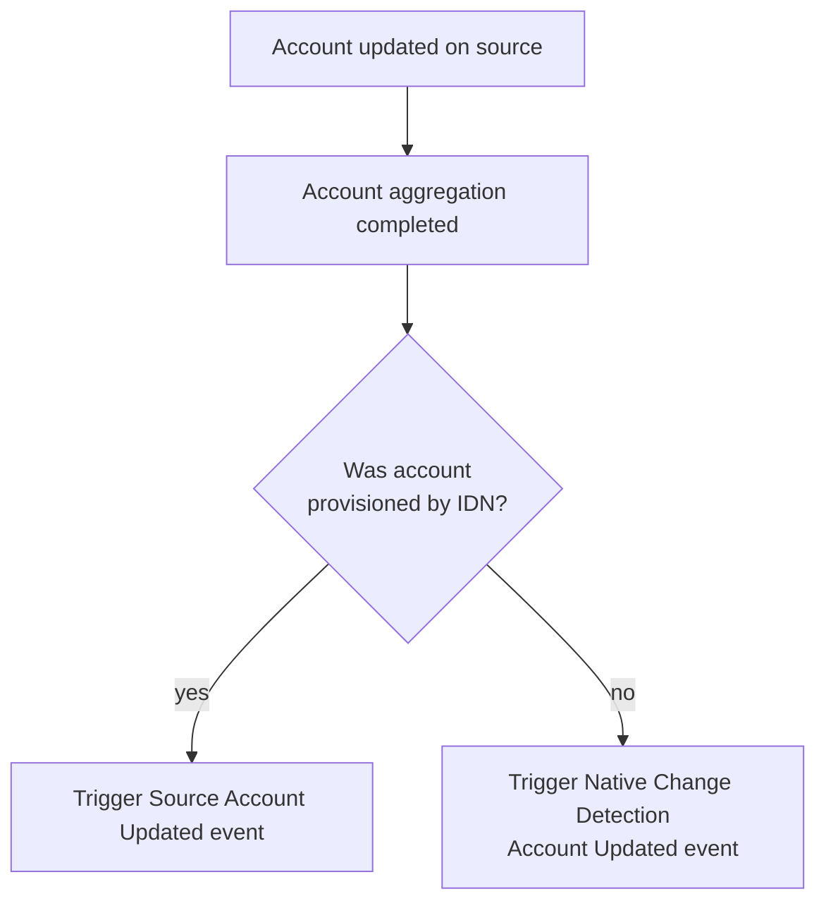

## Event Context

:::caution Important Setup Steps

You must have at least one source configured for Native Change Detection (NCD) before you will receive events from this trigger.  There are two ways you can configure a source for NCD:

1. Invoke the [update native change detection configuration](https://developer.sailpoint.com/idn/api/beta/put-native-change-detection-config) for each source you want to receive events for NCD.
2. Configure the NCD options on the source in the source configuration UI.

:::

Native Change Detection (NCD) events occur when a source account is changed directly on the source as opposed to changing as the result of a provisioning action initiated by SailPoint.  This trigger fires an event when an account is **updated** directly on the target source rather than from a provisioning activity by SailPoint.

<div align="center">



</div>

This event trigger can be used to immediately notify interested parties and remediate accounts that are updated directly on the source.  Some examples of how this trigger can be used are as follows:

- Notify the identity's manager and the source owner of the new account
- Create a micro-certification for the identity to review their new account attributes and entitlements
- Automatically disable or lock accounts updated directly on a source

This is an example input from this trigger:

```json
{
	"identity": {
		"manager": {
			"name": "Martena Heath",
			"id": "2c91808378eb9fa30178fb8caf90097f",
			"type": "IDENTITY"
		},
		"name": "Ann English",
		"alias": "Ann.English",
		"id": "2c91808978eb9fab0178fb8ca6d308fb",
		"type": "IDENTITY"
	},
	"singleValueAttributeChanges": [{
		"newValue": "Call Center Representative",
		"name": "title",
		"oldValue": "Call Center Manager"
	}],
	"entitlementChanges": [{
		"removed": [{
			"owner": null,
			"name": "AccountsReceivable",
			"id": "d0470502d73d4c2e8c7543c712f518ca",
			"value": "CN=AccountsReceivable,OU=Groups,OU=Demo,DC=seri,DC=sailpointdemo,DC=com"
		}],
		"added": [{
			"owner": null,
			"name": "Accounts Payable",
			"id": "2c91808978eb9fab0178fb9482620b71",
			"value": "CN=AccountsPayable,OU=Groups,OU=Demo,DC=seri,DC=sailpointdemo,DC=com"
		}],
		"attributeName": "memberOf"
	}],
	"eventType": "ACCOUNT_UPDATED",
	"source": {
		"owner": {
			"name": "Aaron Andrew",
			"id": "2c9180867a7c46d0017a7ca099d50531",
			"type": "IDENTITY"
		},
		"name": "Active Directory",
		"alias": "Active Directory [source]",
		"id": "2c91808a78efc63e0178fb8624b248c5",
		"type": "SOURCE",
		"governanceGroup": null
	},
	"accountChangeTypes": [
		"ATTRIBUTES_CHANGED",
		"ENTITLEMENTS_ADDED",
		"ENTITLEMENTS_REMOVED"
	],
	"multiValueAttributeChanges": [{
		"removedValues": [],
		"addedValues": [
			"User Account is Disabled"
		],
		"name": "accountFlags"
	}],
	"account": {
		"name": "Ann.English",
		"id": "2c91808378eb9fa30178fb9481a30afa",
		"type": "ACCOUNT",
		"uuid": "{08ee6c6d-7d02-4978-9417-d92ba6a5ed50}",
		"nativeIdentity": "CN=Ann English,OU=Call Center,OU=AI,OU=Demo,DC=seri,DC=sailpointdemo,DC=com"
	}
}
```

- `identity` The identity correlated to this account.
- `singleValueAttributeChanges` Contains a list of account attributes that have changed.  During an account updated event, only account attributes that were modified will be listed, and their `oldValue` will be contain the previous value before the change.
- `entitlementChanges` Contains a list of entitlements that have been added and/or removed on the account.
- `eventType` Will always be `ACCOUNT_UPDATED` for account updated events.
- `source` The source where this account originated from.
- `accountChangeTypes` A list of change types you can expect to see in the event input.
  - Possible values are `ATTRIBUTES_CHANGED`, `ENTITLEMENTS_ADDED`, and `ENTITLEMENTS_REMOVED`.
  - The above example lists all three change types since attributes were changed and entitlements were added and removed.  If an event payload only contains changed attributes, then this list will only contain the `ATTRIBUTES_CHANGED` value.  This can be useful when filtering events based on change types, or quickly checking what types of objects changed in the account before continuing to process the input.
- `multiValueAttributeChanges` List of multivalued attributes that were added and/or removed on the account.
- `account` The details of the account as it appears in IdentityNow.  This information can be used to query the account API for more information.

## Additional Information and Links

- **Trigger Type**: [FIRE_AND_FORGET](../trigger-types.md#fire-and-forget)
