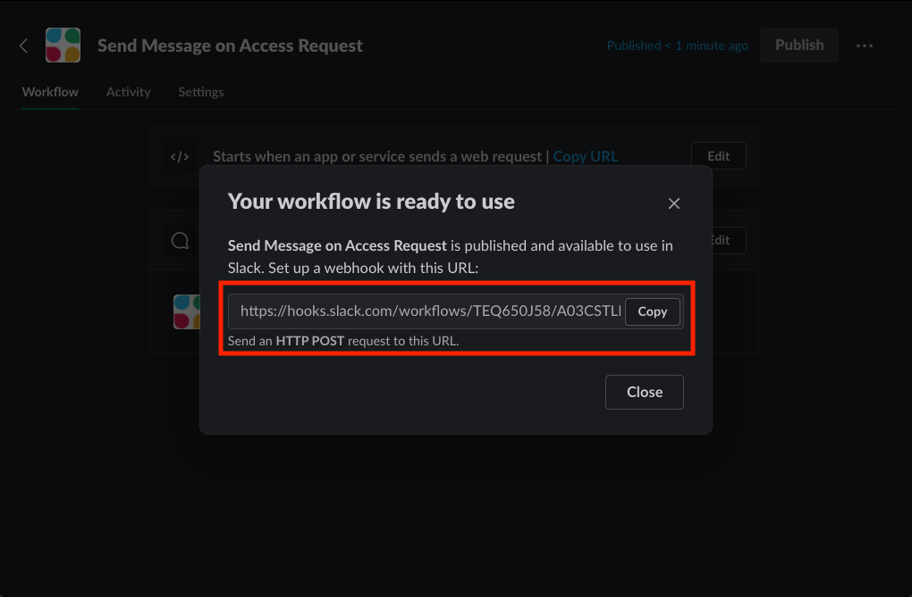

Before you can subscribe to an event trigger, you must prepare a service that can accept incoming HTTP requests from the event trigger service. More specifically, your client service must accept a POST request to an endpoint of its choosing, with the ability to parse the JSON data sent by the trigger. There are many ways to accomplish this, but this guide covers four of the most common types of client services you can build to handle event triggers.

## Webhook Testing Service

There are many webhook testing websites that generate a unique URL you can use to subscribe to an event trigger and explore the data sent by the trigger. One site is https://webhook.site. This site generates a unique URL whenever you open it, which you can copy and paste into the subscription configuration in IdentityNow. Any events that the trigger generates will be sent to this website for you to analyze.

The purpose of webhook testing services is to make it easy to set up a trigger and see the data of the events that will eventually be sent to your production service. This can help in the early development process when you explore the data the event trigger sends and how to best access the data you need.

## Native SaaS Workflows

Some SaaS vendors provide built-in workflow builders in their products so you do not have to use a no-code provider. Slack, for example, has a premium [workflow builder](https://slack.com/help/articles/360035692513-Guide-to-Workflow-Builder) feature that generates a unique URL you can use to configure your subscription. Slack's workflow builder can then listen for events sent by your trigger and perform Slack specific actions on the data, like sending a user a message when his or her access request is approved.

## No-code Provider

No-code/low-code providers, like Zapier and Microsoft Power Automate, make it easy to consume event triggers and perform actions based on the event data. They are popular solutions for those looking to prototype or quickly create automated business processes, and they cater to novices and advanced users alike. Each no-code provider has documentation about how to create a new workflow and subscribe to an event trigger or webhook, so you must find the relevant documentation for your no-code provider to learn how to set one up. Zapier has the ability to configure a webhook action that generates a unique URL you can configure in your event trigger subscription.

## Custom Application

A custom application is one you write in a language of your choosing and host in your own infrastructure, cloud, or on-premise. This is the most advanced option for implementing an event trigger client service. Although it requires a great deal of skill and knowledge to build, deploy, and operate your own service that can consume requests over HTTP, a custom application offers the most power and flexibility to implement your use cases. You can learn more about custom applications by checking out our [Event Trigger Example Application](https://github.com/sailpoint-oss/event-trigger-examples).
