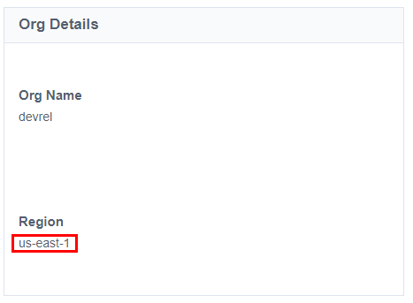
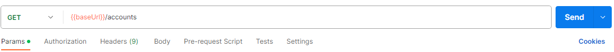

# IP Address Allow List

## Overview

Some SaaS services like Workflows and SaaS Connectivity might need to reach out to internal resources to perform operations inside a customer environment. Instead of opening up those internal resources to the entire internet, you can create an IP Address Allow List so that you can be sure that all SaaS resources can access them while restricting the IP Address range to only allow what is required

## Finding your Tenant's Region

In order to create an IP Address Allow list, you need to know what region your tenant is hosted in. If you don't know this, you can find it by using one of two processes:

### Finding your tenant using the admin console

Simply navigate to the IdentityNow admin console and find the "Org Details" section. There you will find the region your tenant is hosted in:



### Finding your tenant programatically using the IP address returned by IdentityNow

if you cannot access the admin console or want to find the region dynamically through code, here are some steps you can follow to find it:

1. Find the IP address of your tenant by sending an API request in Postman or through any other API framework:



2. After a succesful call to IdentityNow, hover over the globe icon in the response window in postman to get the IP address:


3. Download the [IP Address ranges from AWS](https://ip-ranges.amazonaws.com/ip-ranges.json)

4. Compare the IP address found when calling IdentityNow to the list provided by AWS to determine where your tenant is hosted. You can run a simple Python script to easily find what region the IP address belongs to:

```python
from ipaddress import ip_network, ip_address
import json

def find_aws_region(ip):
  # You can download this file from https://ip-ranges.amazonaws.com/ip-ranges.json
  ip_json = json.load(open('ip-ranges.json'))
  prefixes = ip_json['prefixes']
  my_ip = ip_address(ip)
  region = 'Unknown'
  for prefix in prefixes:
    if my_ip in ip_network(prefix['ip_prefix']):
      region = prefix['region']
      break
  # output should be something like us-east-1
  print(region)

# simply add your IP address here:
find_aws_region('54.234.204.155') 
```

## Using your region to create the allow-list URL

The URL used to find your range of allow list URLs can be constructed using the region found above and the file format desired.

```
https://files.accessiq.sailpoint.com/network/REGION/FILENAME
```

Where REGION is the region of your IdentityNow Tenant and FILENAME is one of the three following:

```
source_ips.yaml
source_ips.json
source_ips.txt
```

For example, if a tenant is hosted in the us-east-1 region, to fetch a yaml representation of the IP address range, use the following URL:

```
https://files.accessiq.sailpoint.com/network/us-east-1/source_ips.yaml
```

which will result in a file similar to the following:

```yaml
"region": "us-east-1"
"source_ips":
- "52.204.100.58/32"
- "52.205.92.24/32"
- "52.206.146.115/32"
```

These IP Address ranges can now be used as an allow list to permit any call from your IdentityNow tenant to access your internal network.

## Limitations

These IP Address ranges can change at any time. The implementation will need to account for this by regularily updating the allow list.