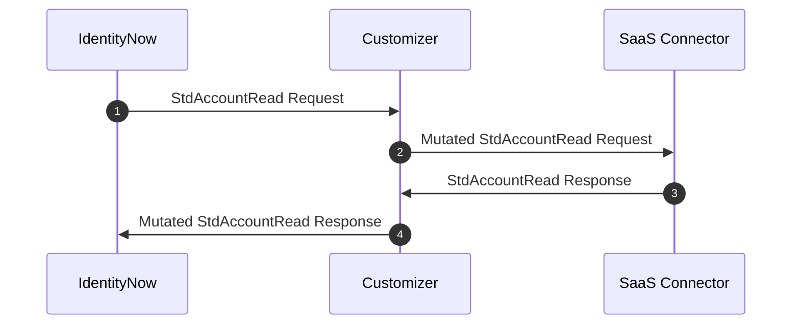

# Overview

SaaS Connectivity Customizers allow you to customize the out of the box connectors similar to how rules work in VA based connectors. By using a connectivity customizer, you can change the input to a connector prior to the data being injested into the connector, or you can change the output from a connector prior to it being sent to IdentityNow.

## How do they work?

SaaS Connectivity Customizers work by sitting in between IdentityNow and the connector. They intercept calls to the connector from IdentityNow and intercept calls to IdentityNow from the connector. When the call is intercepted, custom code can be called to mutate the data in any way that is necessary to change the connector behavior. The below chart shows an example of this with the ```stdAccountRead``` command implemented with the customizer in place.

<div align="center">



</div>