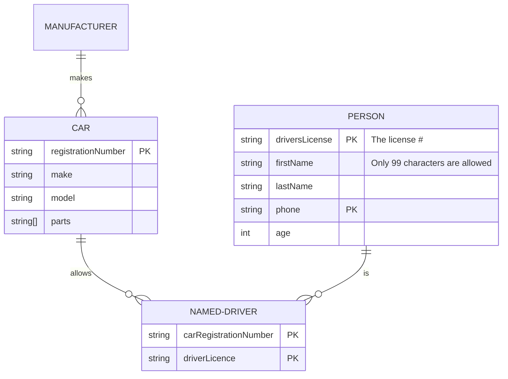

SaaS Connectivity is a cloud based connector runtime that makes developing and deploying web service connectors easier than Connector 1.0 does. However, because the cloud hosts SaaS Connectivity, not a Virtual Appliance (VA), SaaS Connectivity is limited in the types of applications it can connect to. For example, you cannot use SaaS Connectivity to connect to on-prem services that can only communicate within an intranet (no public internet access). This excludes JDBC and Mainframe applications, to name a few.

