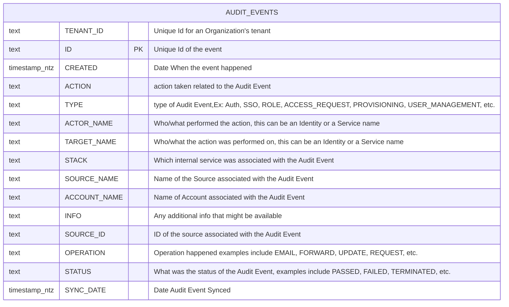

Secure Data Sharing makes SailPoint's Identity data avaiable directly to customer via their Snowflake account. DataSet comprises of structured Identity and audit data. Includes relationship tables that connects Identity with other domain entities like entitlements, roles, access profiles, accounts and Apps. This dataset has an additional Audit events table that is a flattened representation of all the events happening in IdentityNow for your organization.

```mermaid
erDiagram
    IDENTITY_ACCOUNTS {
        text TENANT_ID "Unique Id for an Organization's tenant"
        text ID PK "unique ID of the identity this account is correlated to"
        text DISPLAY_NAME "Human-readable display name of the object"
        timestamp_ntz CREATED_DATE "date when the Identity was created"
        timestamp_ntz UPDATED_DATE "date when the identity was modified"
        text ACCOUNT_ID PK "unique ID of the account"
        text NATIVE_IDENTITY "unique ID of the account generated by the source system"
        text ACCOUNT_DISPLAY_NAME "Human-readable display name of the Account"
        text SOURCE_ID "unique ID of the source this account belongs to"
        text SOURCE_DISPLAY_NAME "display name of the source this account belongs to"
        text SOURCE_TYPE "Type of the Source Ex: Azure Active Directory, Okta etc."
        timestamp_ltz SYNC_DATE "When the row is last synced"
    }
    IDENTITY_ENTITLEMENTS {
        text TENANT_ID "Unique Id for an Organization's tenant"
        text ID PK "Unique Id for the identity"
        text DISPLAY_NAME "Human-readable display name of the object"
        timestamp_ntz CREATED_DATE "date when the Identity was created"
        timestamp_ntz UPDATED_DATE "date when the identity was modified"
        text ENTITLEMENT_ID PK "unique ID of the entitlement"
        text SOURCE_DISPLAY_NAME "display name of the source this entitlement belongs to"
        text ENTITLEMENT_ATTRIBUTE "entitlement attribute name"
        text ENTITLEMENT_VALUE "value of the entitlement"
        timestamp_ltz SYNC_DATE "When the row is last synced"
    }
    IDENTITY {
        text TENANT_ID "Unique Id for an Organization's tenant"
        text ID PK "Unique Id for the identity"
        text NAME "Name of the Object"
        timestamp_ntz CREATED_DATE "date when the identity was created"
        timestamp_ntz UPDATED_DATE "date when the identity was modified"
        timestamp_ntz DELETED_DATE "date when the identity was deleted"
        text DISPLAY_NAME "Human-readable display name of the object"
        text JOB_TITLE "Job Title assigned to the Identity"
        text LOCATION "Location of the Identity"
        text LOCATION_CODE "Location code of the Identity"
        text DEPARTMENT "Department of the identity"
        text EMAIL "The email address of the identity"
        text MANAGER "manager of the identity"
        text STATUS "name of the lifecycle state Ex: Active, leaver, dormant etc."
        timestamp_ntz SYNC_DATE "When the row is last synced"
    }
    IDENTITY_ROLES {
        text TENANT_ID "Unique Id for an Organization's tenant"
        text ID PK "Unique Id for the identity"
        text DISPLAY_NAME "Human-readable display name of the object"
        timestamp_ntz CREATED_DATE "date when the Identity was created"
        timestamp_ntz UPDATED_DATE "date when the identity was modified"
        text ROLE_ID PK "Unique Id for the Role"
        text ROLE_NAME "Name of the Role Object"
        text ROLE_DISPLAY_NAME "Human-readable display name of the role"
        timestamp_ntz SYNC_DATE "When the row is last synced"
    }
    IDENTITY_ACCESS_PROFILES {
        text TENANT_ID "Unique Id for an Organization's tenant"
        text ID PK "Unique Id for the identity"
        text DISPLAY_NAME "Human-readable display name of the object"
        timestamp_ntz CREATED_DATE "date when the Identity was created"
        timestamp_ntz UPDATED_DATE "date when the identity was modified"
        text ACCESS_PROFILE_ID PK "Unique Id for the Access Profile"
        text ACCESS_PROFILE_NAME "Name of the Access Profile Object"
        text ACCESS_PROFILE_DISPLAY_NAME "Human-readable display name of the Access Profile"
        timestamp_ntz SYNC_DATE "When the row is last synced"
    }
    IDENTITY_APPS {
        text TENANT_ID "Unique Id for an Organization's tenant"
        text ID PK "Unique Id for the identity"
        text DISPLAY_NAME "Human-readable display name of the object"
        timestamp_ntz CREATED_DATE "date when the Identity was created"
        timestamp_ntz UPDATED_DATE "date when the identity was modified"
        text APP_ID PK "Unique Id for the APP"
        text APP_DISPLAY_NAME "Human-readable display name of the APP"
        timestamp_ntz SYNC_DATE "When the row is last synced"
    }
    IDENTITY ||--o{ IDENTITY_ACCOUNTS : "has and owns"
    IDENTITY ||--o{ IDENTITY_ENTITLEMENTS : "associated to and owns"
    IDENTITY ||--o{ IDENTITY_ROLES : "associated to and owns"
    IDENTITY ||--o{ IDENTITY_ACCESS_PROFILES: "associated to and owns"
    IDENTITY ||--o{ IDENTITY_APPS: "assocaited with"
```

Consumer Setup:

import ConsumerSetUp from './img/consumer_db_creation_from_listings.mp4';

<video controls>
  <source src={ConsumerSetUp}/>
</video>

https://github.com/sailpoint-oss/developer.sailpoint.com/assets/117477193/cec57fb2-850a-458b-8d1e-07e3cf98a6ba

