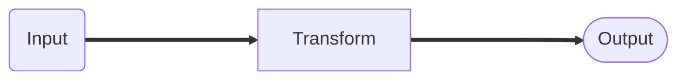
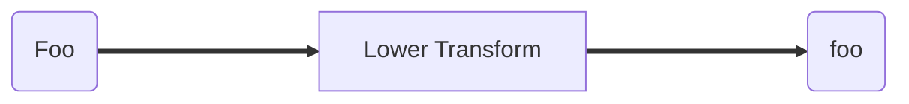
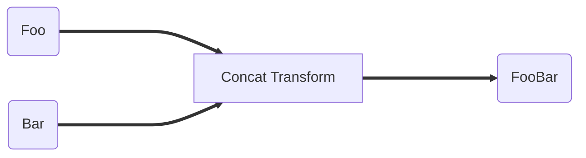
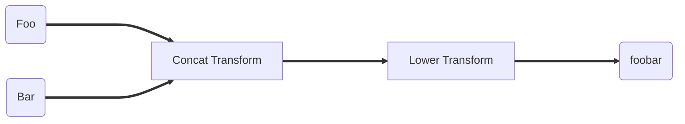
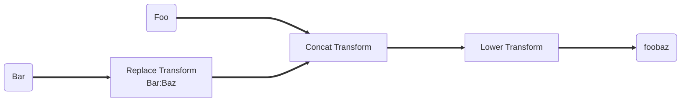

In SailPoint's cloud services, transforms allow you to manipulate attribute
values while aggregating from or provisioning to a source. This guide provides a
reference to help you understand the purpose, configuration, and usage of
transforms.

## What Are Transforms

Transforms are configurable objects that define easy ways to manipulate
attribute data without requiring you to write code. Transforms are configurable
building blocks with sets of inputs and outputs:

<div align="center">



</div>

Because there is no code to write, an administrator can configure these by using
a JSON object structure and uploading them into IdentityNow using
[IdentityNow's Transform REST APIs](/idn/api/v3/transforms).

:::info

Sometimes transforms are referred to as Seaspray, the codename for transforms.
IdentityNow Transforms and Seaspray are essentially the same.

:::

## How Transforms Work

Transforms typically have an input(s) and output(s). The way the transformation
occurs mainly depends on the type of transform. Refer to
[Operations in IdentityNow Transforms](./operations/index.md) for more
information.

For example, a [Lower transform](./operations/lower.md) transforms any input
text strings into lowercase versions as output. So if the input were `Foo`, the
lowercase output of the transform would be `foo`:

<div align="center">



</div>

There are other types of transforms too. For example, an
[E.164 Phone transform](./operations/e164-phone.md) transforms any input phone
number strings into an E.164 formatted version as output. So if the input were
`(512) 346-2000`, the output would be `+1 5123462000`:

<div align="center">


</div>

### Multiple Transform Inputs

In the previous examples, each transform had a single input. Some transforms can
specify more than one input. For example, the
[Concat transform](./operations/concatenation.md) concatenates one or more
strings together. If `Foo` and `Bar` were inputs, the transformed output would
be `FooBar`:

<div align="center">



</div>

### Complex Nested Transforms

For more complex use cases, a single transform may not be enough. It is possible
to link several transforms together. IdentityNow calls these 'nested' transforms
because they are transform objects within other transform objects.

An example of a nested transform would be using the previous
[Concat transform](./operations/concatenation.md) and passing its output as an
input to another [Lower transform](./operations/lower.md). If the inputs `Foo`
and `Bar` were passed into the transforms, the ultimate output would be
`foobar`, concatenated and in lowercase.

<div align="center">



</div>

There is no hard limit for the number of transforms that can be nested. However,
the more transforms applied, the more complex the nested transform will be,
which can make it difficult to understand and maintain.

## Configuring Transform Behavior

Some transforms can specify an attributes map that configures the transform
behavior. Each transform type has different configuration attributes and
different uses. To better understand what is configurable per transform, refer
to the Transform Types section and the associated Transform guide(s) that cover
each transform.

It is possible to extend the earlier complex nested transform example. If a
Replace transform, which replaces certain strings with replacement text, were
added, and the transform were configured to replace `Bar` with `Baz` the output
would be added as an input to the Concat and Lower transforms:

<div align="center">



</div>

The output of the Replace transform would be `Baz` which is then passed as an
input to the Concat transform along with `Foo` producing an output of `FooBaz`.
This is then passed as an input into the Lower transform, producing a final
output of `foobaz`.

## Transform Syntax

Transforms are JSON objects. Prior to this, the transforms have been shown as
flows of building blocks to help illustrate basic transform ideas. However at
the simplest level, a transform looks like this:

```json
{
  "name": "Lowercase Department",
  "type": "lower",
  "attributes": {
    "transform-attribute-1": "attribute-1-value",
    "transform-attribute-2": "attribute-2-value"
  }
}
```

There are three main components of a transform object:

1. `name` - This specifies the name of the transform. It refers to a transform
   in the IdentityNow API or User Interface (UI). Only provide a name on the
   root-level transform. Nested transforms do not have names.

2. `type` - This specifies the transform type, which ultimately determines the
   transform's behavior.

3. `attributes` - This specifies any attributes or configurations for
   controlling how the transform works. As mentioned earlier in
   [Configuring Transform Behavior](#configuring-transform-behavior), each
   transform type has different sets of attributes available.

## Template Engine

Seaspray ships with the Apache Velocity template engine that allows a transform
to reference, transform, and render values passed into the transform context.
Every string value in a Seaspray transform can contain templated text and will
run through the template engine.

### Example

In the following string, the text `$firstName` is replaced by the value of
firstName in the template context. The same goes for `$lastName`.

If
$firstName=John and $lastName=Doe then the string `$firstName.$lastName`would render as`John.Doe`.

### Identity Attribute Context

The following variables are available to the Apache Velocity template engine
when a transform is used to source an identity attribute.

| Variable            | Type                             | Description                                                   |
| ------------------- | -------------------------------- | ------------------------------------------------------------- |
| identity            | sailpoint.object.Identity        | This is the identity the attribute promotion is performed on. |
| oldValue            | Object                           | This is the definition of the attribute being promoted.       |
| attributeDefinition | sailpoint.object.ObjectAttribute | This is the attribute's previous value.                       |

### Account Profile Context

The following variables are available to the Apache Velocity template engine
when a transform is used in an account profile.

| Variable    | Type                         | Description                                                               |
| ----------- | ---------------------------- | ------------------------------------------------------------------------- |
| field       | sailpoint.object.Field       | This is the field definition backing the account profile attribute.       |
| identity    | sailpoint.object.Identity    | This is the identity the account profile is generating for.               |
| application | sailpoint.object.Application | This is the application backing the source that owns the account profile. |
| current     | Object                       | This is the attribute's current value.                                    |

## Implicit vs Explicit Input

A special configuration attribute available to all transforms is input. If the
input attribute is not specified, this is referred to as implicit input, and the
system determines the input based on what is configured. If the input attribute
is specified, then this is referred to as explicit input, and the system's input
is ignored in favor of whatever the transform explicitly specifies. A good way
to understand this concept is to walk through an example. Imagine that
IdentityNow has the following:

- An account on Source 1 with department set to `Services`.
- An account on Source 2 with department set to `Engineering`.

The following two examples explain how a transform with an implicit or explicit
input would work with those sources.

### Implicit Input

An identity profile is configured the following way:


As an example, the "Lowercase Department" transform being used is written the
following way:

```json
{
  "name": "Lowercase Department",
  "type": "lower",
  "attributes": {}
}
```

Notice that the attributes has no input. This is an implicit input example. The
transform uses the input provided by the attribute you mapped on the identity
profile.

In this example, the transform would produce `services` when the source is
aggregated because Source 1 is providing a department of `Services` which the
transform then lowercases.

### Explicit Input

As an example, the `Lowercase Department` has been changed the following way:

```json
{
  "name": "Lowercase Department",
  "type": "lower",
  "attributes": {
    "input": {
      "type": "accountAttribute",
      "attributes": {
        "attributeName": "department",
        "sourceName": "Source 2"
      }
    }
  }
}
```

Notice that there is an `input` in the attributes. This is an explicit input
example. The transform uses the value Source 2 provides for the `department`
attribute, ignoring your configuration in the identity profile.

In this example, the transform would produce "engineering" because Source 2 is
providing a department of `Engineering` which the transform then lowercases.
Though the system is still providing an implicit input of Source 1's department
attribute, the transform ignores this and uses the explicit input specified as
Source 2's department attribute.

:::tip

This is also an example of a nested transform.

:::

### Account Transforms

Account attribute transforms are configured on the account create profiles. They
determine the templates for new accounts created during provisioning events.

#### Configuration

These can be configured in IdentityNow by going to **Admin** > **Sources** > (A
Source) > **Accounts** (tab) > **Create Profile**. These can also be configured
with IdentityNow REST APIs.

You can select the installed, available transforms from this interface.
Alternately, you can add more complex transforms with REST APIs.

In the following example, we can call the
[Create Provisioning Policy API](/idn/api/v3/create-provisioning-policy) to
create a full name field using the first and last name identity attributes.

```bash
curl --location --request POST 'https://{tenant}.api.identitynow.com/v3/sources/{source_id}/provisioning-policies' \
--header 'Content-Type: application/json' \
--header 'Accept: application/json' \
--header 'Authorization: Bearer {token}' \
--data-raw '{
    "name": "Account",
    "description": null,
    "usageType": "CREATE",
    "fields": [
        {
            "name": "displayName",
            "transform": {
                "type": "concat",
                "attributes": {
                    "values": [
                        {
                            "attributes": {
                                "name": "firstName"
                            },
                            "type": "identityAttribute"
                        },
                        " ",
                        {
                            "attributes": {
                                "name": "lastName"
                            },
                            "type": "identityAttribute"
                        }
                    ]
                }
            },
            "attributes": {},
            "isRequired": false,
            "type": "string",
            "isMultiValued": false
        },
        {
            "name": "firstName",
            "transform": {
                "type": "identityAttribute",
                "attributes": {
                    "name": "firstName"
                }
            },
            "attributes": {},
            "isRequired": false,
            "type": "string",
            "isMultiValued": false
        },
        {
            "name": "lastName",
            "transform": {
                "type": "identityAttribute",
                "attributes": {
                    "name": "lastName"
                }
            },
            "attributes": {},
            "isRequired": false,
            "type": "string",
            "isMultiValued": false
        },
    ]
}'
```

For more information on the IdentityNow REST API endpoints used to managed
transform objects in APIs, refer to
[IdentityNow Transform REST APIs](/idn/api/v3/transforms).

:::tip

For details about authentication against REST APIs, refer to the
[authentication docs](../../../api/authentication.md).

:::

#### Testing Transforms on Account Create

To test a transform for an account create profile, you must generate a new
account creation provisioning event. This involves granting access to an
identity who does not already have an account on this source; an account is
created as a byproduct of the access assignment. This can be initiated with
access request or even role assignment.

#### Applying Transforms on Account Create

Once the transforms are saved to the account profile, they are automatically
applied for any subsequent provisioning events.

## Testing Transforms

**Testing Transforms in Identity Profile Mappings**

To test a transform for identity data, go to **Identities** > **Identity
Profiles** and select **Mappings**. Select the transform to map one of your
identity attributes, select **Save**, and preview your identity data.

**Testing Transforms for Account Attributes**

To test a transform for account data, you must provision a new account on that
source. For example, you can create an access request that would result in a new
account on that source, or you can assign a new role.

## Transform Best Practices

- **Designing Complex Transforms** - Start with small transform _building
  blocks_ and add to them. It can be helpful to diagram out the inputs and
  outputs if you are using many transforms.

- **JSON Editor** - Because transforms are JSON objects, it is recommended that
  you use a good JSON editor. Atom, Sublime Text, and Microsoft Code work well
  because they have JSON formatting and plugins that can do JSON validation,
  completion, formatting, and folding. This is very useful for large complex
  JSON objects.

- **Leverage Examples** - Many implementations use similar sets of transforms,
  and a lot of common solutions can be found in examples. Feel free to share
  your own transform examples on the
  [Developer Community forum](https://developer.sailpoint.com/discuss)!

- **Same Problem, Multiple Solutions** - There can be multiple ways to solve the
  same problem, but use the solution that makes the most sense to your
  implementation and is easiest to administer and understand.

- **Encapsulate Repetition** - If you are copying and pasting the same
  transforms over and over, it can be useful to make a transform a standalone
  transform and make other transforms reference it by using the reference type.

- **Plan for Bad Data** - Data will not always be perfect, so plan for data
  failures and try to ensure transforms still produce workable results in case
  data is missing, malformed, or there are incorrect values.

## Transforms vs. Rules

Sometimes it can be difficult to decide when to implement a transform and when
to implement a rule. Both transforms and rules can calculate values for identity
or account attributes.

Despite their functional similarity, transforms and rules have very different
implementations. Transforms are JSON-based configurations, editable with
IdentityNow's transform REST APIs. Rules are implemented with code (typically
BeanShell, a Java-like syntax), so they must follow the
[IdentityNow Rule Guidelines](https://community.sailpoint.com/docs/DOC-12122),
and they require SailPoint to be reviewed and installed into the tenant. Rules,
however, can do things that transforms cannot in some cases.

Because transforms have easier and more accessible implementations, they are
generally recommended. With transforms, any IdentityNow administrator can view,
create, edit, and delete transforms directly with REST API without SailPoint
involvement.

If something cannot be done with a transform, then consider using a rule. When
you are transitioning from a transform to a rule, you must take special
consideration when you decide where the rule executes.

- If you are calculating identity attributes, you can use
  [Identity Attribute rules](https://community.sailpoint.com/docs/DOC-12616)
  instead of identity transforms.

- If you are calculating account attributes (during provisioning), you can use
  [Attribute Generator rules](https://community.sailpoint.com/docs/DOC-12645)
  instead of account transforms.

- All rules you build must follow the
  [IdentityNow Rule Guidelines](https://community.sailpoint.com/docs/DOC-12122).

If you use a rule, make note of it for administrative purposes. The best
practice is to check in these types of artifacts into some sort of version
control (e.g., GitHub, et. Al.) for records.
