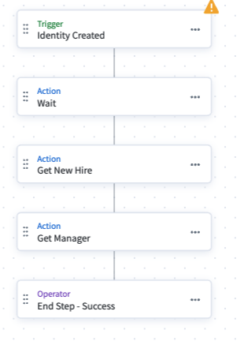
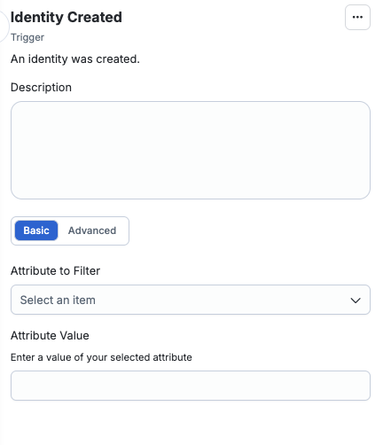
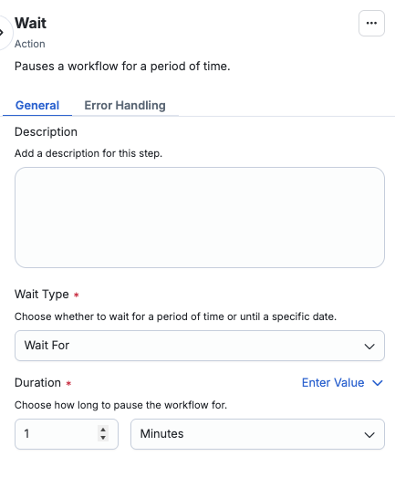
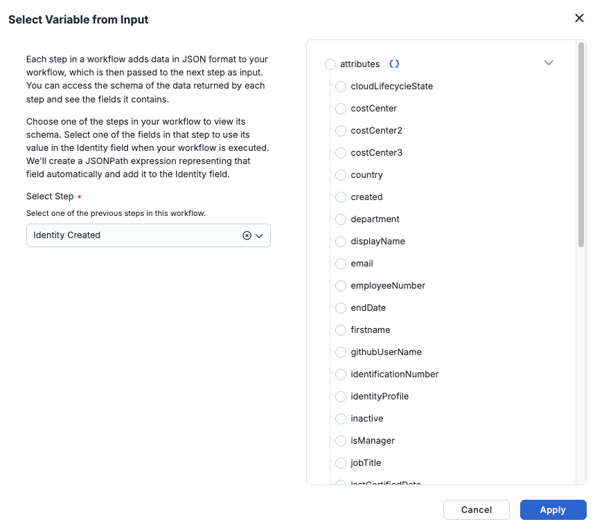
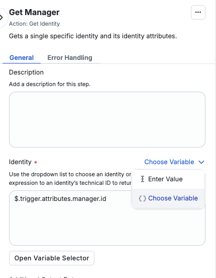
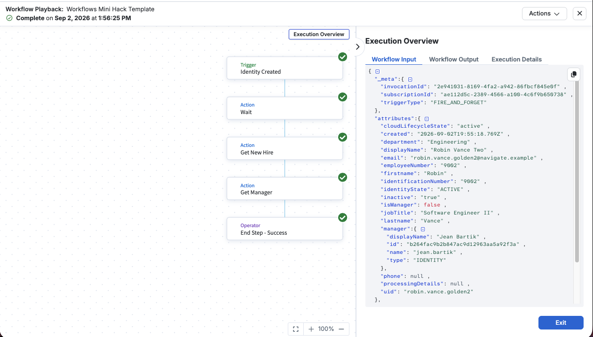

nt---
title: Identity Workflows
description: Finish an event-triggered workflow that emails an onboarding notice the moment a new identity is created.
wrapperClassName: hack-day-track
---

[← All Hack Day tracks](/hack-day)

# Track 01 · Identity Workflows

In this mini hack, you will turn an identity event into a message. You will stand up an authoritative source and finish a partly built Workflow Studio
workflow that wakes up the moment a new identity appears in SHF, looks up who
that person reports to, and emails a formatted onboarding notice — with the new hire's actual
department, title, and manager in it. No CLI, no local install, and nothing to deploy.

Nothing here is simulated. You create the source, the trigger is a genuine SHF event, the identity is one you create
yourself by loading a row into an HR feed, and the email lands in your own inbox, which is what you
show a developer advocate at the end.

**You will need:** a browser, the mini hack tenant's admin credentials, and access to your email.
#### Files you need

- **[`workflows-hack-day-schema.csv`](./workflows-hack-day-schema.csv)** — the account schema. One line,
  twelve column names, no data.
- **[`hr-feed.csv`](./hr-feed.csv)** — the eight baseline employees. Twelve columns wide.

## What you are building

```
  You append a row          SHF creates the         Your workflow fires
  to the HR feed CSV  --->  identity during   --->  on idn:identity-created
  and aggregate             identity refresh
                                                               |
                                                               v
                                                     +------------------+
                                                     | Wait             |  <- pre-built
                                                     +---------+--------+
                                                               |
                                                               v
                                                     +------------------+
                                                     | Get New Hire     |  <- pre-built
                                                     +---------+--------+
                                                               |
                                                               v
                                                     +------------------+
                                                     | Get Manager      |  <- pre-built
                                                     +---------+--------+
                                                               |
                                                               v
                                                     +------------------+
                                                     | Send Email       |  <- YOU BUILD
                                                     | -> your inbox    |     THIS ONE
                                                     +---------+--------+
                                                               |
                                                               v
                                                       an email you can
                                                       show a developer advocate
```

You are building one step in the workflow and creating an authoritative source. That sounds small, but it is the step where two systems that know nothing
about each other have to be made to agree — which is most of what integration work actually is.


## What is already in your tenant

| Thing | Name | Where to find it | What it is for |
| --- | --- | --- | --- |
| Reference source | `Workflows Mini Hack HR Feed` | **Admin → Connections → Sources**, then open it by name | A finished, working version of the authoritative source you are about to build. Open it when you want to check your own work against something known-good. |
| Reference identities | 8 of them | **Admin → Identities**, then search a name — try `Margaret Hamilton` | Ada Byron, Grace Hopper, Jean Bartik and friends, created by the reference source. Their identity ids are the real ids you test with in step 7. |
| Template workflow | `Workflows Mini Hack Template` | **Admin → Workflows**, then open it | Trigger configured, three steps built, **disabled**, with real execution history. You read it, copy it, and edit the copy. |

:::caution

**Please do not edit any of the three templates.** Everyone will be pointed at the same three
objects. A schema upload replaces a schema; an aggregation replaces every account; a saved workflow
edit is immediate. One person editing shared objects breaks the exercise for everybody else, which is
exactly why you are building your own copies.

:::

Everything else, you build:

| You will create | Name it | Built in |
| --- | --- | --- |
| A delimited-file source | `<your name> HR Feed` | Step 1 |
| An identity profile | `<your name> HR Feed` | Step 4 |
| A workflow | `<your name> Identity Onboarding` | Step 6 |

**Please add your name to all three.** You will be working in a shared tenant, and this will make the checking process easier for everyone!

Two items are worth opening before you start, because the workflow depends on them and it's important to understand how they are used before moving forward:

- **Open `Margaret Hamilton`** under Admin → Identities. Her **Manager** field shows *Jean Bartik* as
  a link, not as the text `jean.bartik`. That link is what makes the manager lookup in your workflow
  possible — it exists because the identity profile resolved a `uid` from the CSV into a pointer at a
  real person.
- **Open the source's `Accounts`** list, under Account Management. Click on the `margaret.hamilton` account to see the details and notice that
  `managerUid` is just a string reading `jean.bartik`. Accounts hold text; identities hold references.
  That difference comes up again in step 1.


Work through the steps in order. You build one step, and each stage is testable on its own before you
move to the next. If a step leaves you stuck, open the hint under it to unblock yourself and keep
moving.

### 1. Build your own HR feed

These four steps will walk you through creating an HR source to test and build your workflow on. You will
initially have eight identities that know who they report to. Each step is checkable on its own — do not 
move on until each check passes, because everything downstream depends on it.

#### 1. Create your own delimited-file source

Go to **Admin → Connections → Sources** and click **Create New** in the upper right-hand corner. Search the 
connector list for **Delimited File** and click **Configure**. Inside the creation window, you will add the 
following information:

| Field | Value |
| --- | --- |
| Source Name | `<your name> HR Feed` |
| Description | Anything. `Navigate Workflows mini hack` is fine. |
| Source Owner | `hack.day` — start typing it and pick it from the list |
| Platform Type | Saas |

The rest of the optional values can be left blank.

Click **Continue**. You now have an empty source where you will add your employees.

**Why a delimited file?** Because it is the shortest path to a *real* authoritative source. There is no
system on the far end, no credentials, and no network call — you upload a CSV, and SHF treats it as the
complete, current truth about a population of people. Every identity in this exercise arrives because
you put a line in a text file, just like how many HR feeds work.

**Why `hack.day` as the owner?** A source owner is the person accountable for the source, as required by
SHF. Using the shared account in this tenant keeps every source attributable to the event rather than 
to whoever clicked Create.

:::tip

**Check before moving on:** your source appears in **Admin → Connections → Sources** with your name in
it, and opening it shows an account count of zero.

:::

#### 2. Upload the account schema

Open your source and go to **Account Management → Account Schema** in the left-hand column. Click 
**Upload Schema** in the top-right corner and upload **[`workflows-hack-day-schema.csv`](./workflows-hack-day-schema.csv)**.

After uploading, a pop-up will ask for attributes to represent the Account ID and the Account name. Set them both to **uid**.

Looking at this file, there is not a lot to it:
```csv
employeeId,uid,firstname,lastname,fullName,email,department,jobTitle,managerUid,location,startDate,lifecycleState
```
A **schema file** for a delimited source is nothing but the header row — the names of
the columns your CSV will have.

**Why upload a schema at all, separately from the data?** Because a CSV on its own has no structure that
SHF can rely on. The schema is the contract: these twelve attributes exist, they are called exactly
this, and one of them identifies an account.

#### 3. Set up manager correlation

The schema now tells SHF that a column called `managerUid` exists. It does not tell SHF that the column
*means* anything — as far as the platform is concerned, it is one more string, no different from
`location`. We need to let SHF know the values associated with the columns.

In your source on the left-hand column, go to **Account Management → Account Correlation** and scroll down
to **Manager Correlation**. Set:

| Field | Value |
| --- | --- |
| Identity Attribute | `Name` |
| Account Attribute | `managerUid` |

Click **Save**.

:::caution

**Identity Attribute is `Name`, not `Manager` and not `uid`.** You are choosing the attribute to match on the manager's side of the 
relationship that will equal `jean.bartik`, for example.

:::

#### 4. Aggregate the eight baseline accounts

Download **[`hr-feed.csv`](./hr-feed.csv)** and **do not edit it yet.** The file should contain eight rows,
one per baseline employee.

In your source, go to **Account Management → Account Aggregation** on the left-hand column and drag and drop the file into the 
**Import Accounts** section. The aggregation will start automatically, and you can watch the progress of the aggregation in 
**Latest Account Aggregation** on the same page.

#### 5. Create your identity profile and map the attributes

Accounts are not identities. An account is a row on a source; an identity is the person SHF governs, and
an **identity profile** is the thing that turns the former into the latter. You now need to produce identities.

Go to **Admin → Identity Management → Identity Profiles** and click **Create New**. You will add the following
information in the pop-up window:

| Field | Value |
| --- | ---|
| Name  | `<your name> HR Feed` |
| Authoritative Source | your source from step 1 |

Click **Create**, then open the **Mappings** tab. For each identity attribute, you choose which account 
attribute it reads from. Update only these mappings; you can leave the rest alone. Be sure
to choose your source with your name from the **Source** column in every row you update:

| Identity attribute | Account attribute |
| --- | --- | 
| Username (uid) | `uid`| 
| Work Email | `email` |
| Family Name | `lastname` |
| Given Name | `firstname` |
| Department | `department` |
| Display Name | `uid` | 
| Job Title | `jobTitle` |                                                                                         
| Manager Name | `managerUid`  |

Scroll to the bottom of the page and click **Save**, then click **Apply Changes** in the top-right corner.

#### 6. Verify the reference resolved

This is the checkpoint for all of Part 1, where you confirm your aggregation and mappings are correct.

Go to **Admin → Sources → Your Source → Account Management → Accounts** and look at `Margaret Hamilton`. There
should be two hyperlinks with her username; click on the hyperlink under the **Identity** column. Look at her **Manager**
field. It should read `jean.bartik`, as a clickable link to Jean's identity. Without the manager correlation, your workflow
has a name it can print but cannot fetch.


<details>
<summary>See details: the Manager field is blank</summary>

1. **Have identities finished processing?** The resolution runs during identity refresh, not on save.
   Give it a minute and reload.
2. **Is Manager Correlation configured on your source?** **Account Correlation → Manager Correlation**,
   set to `Name` ← `managerUid`, and save. 
3. **Is Manager mapped to `managerUid`** in your identity profile? Open the Mappings tab and confirm.
   Mapping it to `manager`, `employeeId`, or leaving it unmapped all produce a blank field.
4. **Is `uid` mapped to `uid`** in your identity profile? Manager Correlation matches against the
   identity's `Name`, which comes from `uid`. If that mapping is missing or points elsewhere, there is
   nothing for `jean.bartik` to match.
5. **Did you open the right Margaret?** There may be multiple in this tenant. The one on the reference source
   will look correct no matter what you have misconfigured on yours.

</details>

:::info

**Ada Byron, Katherine Johnson, and Mary Jackson have a blank `managerUid`** in the CSV — they sit at the
top of the org chart. Their identities will not have a manager.
:::

### 2. A tour of the template workflow

Part 1 gave you a population of people who know who they report to. Part 2 turns an arrival into a
message. Before you build anything, spend a few minutes understanding what this workflow does.

**A workflow, in this platform, is two things:** a *trigger* that decides when it runs, and an
ordered chain of *steps* that run when it does. There is no code. Each step is a pre-built action you
configure by filling in fields, and each one can read the output of any step before it.

#### Finding the workflow

Go to **Admin → Workflows**. You will see `Workflows Mini Hack Template` with a status of
**Disabled**. Open it, then click **Edit in Builder** to open it in the builder. This will 
be the template you will create a copy of later.

**Why it is disabled.** A disabled workflow is not subscribed to its trigger. Real
`idn:identity-created` events will fire in this tenant while you work, and they will pass this
workflow by without running it.

**Test Workflow runs on demand regardless of the status**, so you can execute this as often
as you like while it is disabled, reading real output the whole time. You flip it to Enabled in step 4,
once it works — and only then does a real joiner set it off.

#### The canvas

Open the workflow, then click the **Edit in Builder** button in the top-right header.



The five nodes, top to bottom, are: the **trigger**, **Wait**, **Get New Hire**, **Get Manager**, and an
**End** step.

Two things to note about the shape of this workflow. Every step **points at the next one**, and the last step points at
an **End Step**, which is what tells the platform the run finished successfully.

Your work goes **between `Get Manager` and the End Step**. Everything above that is a working example
of one pattern.

#### The trigger



**A trigger answers "when should this run?"** Every workflow has exactly one trigger, and without it a workflow is just a list of steps. There are
three kinds: **scheduled** (i.e. every night at 2 am), **external** (something POSTs to a URL to start it),
and **event** (the platform itself tells you something happened).

This one is an **event trigger** on **Identity Created**, which is the event the platform publishes
the instant a new identity is created. That choice is what makes this a *joiner*
workflow rather than a report: nobody schedules it, nobody calls it, and it cannot run unless a real
person genuinely arrived.

The **filter** field is empty. A filter is an expression the platform evaluates on the event *before*
your workflow is invoked — events that fail it never reach you at all. Empty filters mean every identity
creation in this tenant reaches your workflow, and SHF may warn you about that. It is fine
here, because the only identities ever created in your tenant come from the HR feed.

#### The Wait step



**A Wait step pauses the run.** The run holds at this point for the duration you set, then continues.

We wait 1 minute to give the identity time to fully process. The identity profile populates attributes and
correlates the manager during the same refresh that creates the identity, so a lookup that runs the
instant the event arrives can return less than the finished record. One minute is comfortably enough,
and it costs you nothing here.

#### `Get New Hire`


**`Get New Hire` is a `Get Identity` action that was renamed.**

- **`Get Identity` is a built-in action.** Give it one identity id, it calls the platform's identity
  API, and it hands back that identity's full record — every attribute the platform holds, not
  just the few the event carried.
- **The name is yours to choose.** `Get New Hire` describes the *role* this lookup plays in this
  workflow. Two steps in this workflow are the same action doing different jobs, and naming them for
  their job is what keeps your workflow readable.
- **Its input is a variable, not a fixed value.** The identity-id field reads
  `$.trigger.identity.id` — "the id of the identity this event was about." Every run applies to a different person.

**How it applies here:** This step is how they get into the workflow. The event says *who*; this looks up *everything about them*.

#### The variable picker



**This is how data moves between steps.** Any field that accepts a variable has this control, and it
lists everything available at that point in the flow — the trigger's payload, plus the output of
every step above the one you are editing. Pick a value and it writes the path for you.

It's worth noting that a step can only see steps *above* it, which is why order
matters. And the path it writes refers to a step by an internal name that is not always its display
name.

#### `Get Manager`




**The same `Get Identity` action a second time**, renamed for its job, with one difference: its input comes from **`Get New Hire`'s output** rather than the
trigger. Specifically `managerRef.id` — the manager's identity id, taken off the record the previous
step fetched.

**Why a second lookup at all?** Because the new hire's record does not contain their manager. It
contains a *reference* to their manager — an id and a name — in the same way a row in a database
holds a foreign key rather than the whole related row. To put the manager's real name and email
address in your email, this step fetches that second person.

**How it applies here:** two of your six required values come from here. Step 1 explains why it reads `managerRef.id` and not the similar-looking field beside it.

#### Execution history

Click **Back** in the top-left corner and then **Executions** in the left hand column. **Every time a workflow
runs, it leaves a record here** — what triggered it, when, whether it succeeded, and what every step did.
This is where you go when something did not work.

There is already one example run in here. You will borrow a payload from this run in step 2.

#### Inside a single run



Click **Actions → View Execution**, then any step inside it, to see exactly what that step received and what it returned.
This panel is the most useful debugging tool in Workflow Studio — it shows you what your workflow *actually sent*.

#### What the event actually hands you  

Inside the workflow playback, click the trigger, then look at what the event gives you. This is a real payload, captured from a real
identity creation in a tenant just like yours:

```json
{
  "_meta":{
    "invocationId": "1e9dfacc-9e9e-4048-a922-06a8740261c3" ,
    "subscriptionId": "bede1adf-39c9-47aa-b34f-c9996c807d5e" ,
    "triggerType": "FIRE_AND_FORGET"
  },
  "attributes":{
    "created": "2026-09-29T14:01:06.654Z" ,
    "displayName": "radia.perlman" ,
    "email": null ,
    "employeeNumber": null ,
    "firstname": null ,
    "inactive": "true" ,
    "isManager": false ,
    "lastname": null ,
    "manager": null ,
    "phone": null ,
    "processingDetails": null
  },
  "identity":{
    "id": "8e84fa10ab3641d9bf5d7f1293c0b772" ,
    "name": "radia.perlman" ,
    "type": "IDENTITY"
  }
}
```


#### Why you fetch the details after the trigger

Inside the workflow playback, click **`Get New Hire`**, and read its output panel next to the payload above.

Same person. One has `department`, `jobTitle`, a real `displayName`, and a manager reference.

Treat the event as a notification rather than as a data feed. It tells you that something happened and it
hands you an id, and the full record is one lookup away. The
fetched record is complete and it carries the manager reference the payload doesn't have.

#### The two manager fields

Now click **`Get Manager`** and look at where its id comes from in the input panel. Then look back at `Get New Hire`'s
output, where you will find two different manager fields:

| Field | Holds | Useful for a lookup? |
| --- | --- | --- |
| `attributes.manager` | The string `alan.turing` — a `uid` | **No.** It is a name, not an id. |
| `managerRef` | `{ "id": "...", "name": "alan.turing" }` | **Yes.** `managerRef.id` is an identity id. |

`Get Identity` needs an id, so only `managerRef.id` works. That distinction — a reference to a person
versus a string that names them — is the same one that runs through this whole exercise.

#### 2. Copy the template into your own workflow

Now that you have explored the workflow template, it's time to create your own!

Click the X in the top-right corner of the workflow playback until you get to the main workflows page.
Find the `Workflows Mini Hack Template` in the list. Use the actions menu on it and choose **Duplicate**.
Be sure to insert your name into the name of the workflow.

<details>
<summary>See details: the template workflow is not in your tenant or invalid</summary>

If `Workflows Mini Hack Template` is missing or invalid, build the workflow yourself from the file below.

<strong><a href="/files/workflows-hack-day-template.json" download><code>workflows-hack-day-template.json</code></a></strong> — the template workflow, with the trigger and all three steps in it. Download it first.

1. Go to **Admin → Workflows** and click **New Workflow**.
2. Click **Upload File** and upload the file you downloaded above.
3. Name it `<your name> Identity Onboarding`.
4. Click **Continue to Builder**. The canvas must show the trigger, **Wait**, **Get New Hire**, **Get Manager**,
   and an End step.

A workflow you build this way has no execution history, so you have no captured payload to test with. Step 3
tells you to copy a payload from the template run. Instead, take the id of one of the eight baseline identities
from **Admin → Identities** and put it in a payload of your own, in the shape of the example payload above.

</details>

Open your copy and confirm three things:

- It is **Disabled**.
- Its execution history is **empty** — it has never run.
- Its canvas has the same five nodes as the template: trigger, Wait, `Get New Hire`, `Get Manager`, End.

:::caution

**Everything from here on happens in your copy.** If you catch yourself editing `Workflows Mini Hack Template`,
stop, close it, and reopen yours — check the name in the header before you type.

:::

#### Copy the payload out of the template

Your copy has never run, so it has no execution history of its own to test with. The template does —
that is the one example run you saw a moment ago, and you are about to use its payload to test.

1. Open **`Workflows Mini Hack Template` → Executions**.
2. On the completed run, click **Actions → View Execution**.
3. Click the **trigger** node and copy its input payload.
4. Keep it on your clipboard, or paste it somewhere you can get at it again — you will reuse it every
   time you test.


### 3. Test it and read the output

Navigate back to the builder of your workflow copy and click **Test Workflow**. It asks for a trigger 
payload – this is where you will delete the pre-populated input and paste the payload you copied from
the template run.

:::warning

**Do not use the default sample payload it offers you.** That payload is SailPoint's documentation
example — John Doe, `william.wilson`, `department: "Sales"`, `uid: "E009"` — and it will fail
immediately with `404 Not Found`, because those identity ids do not exist in your tenant. It is also
**fully populated**, which makes it actively misleading about what a real event carries.

:::

Run it. You are looking for **three green steps**, and two output panels worth reading:

- **`Get New Hire`** — a full identity record. Note the exact paths to `department`, `jobTitle`, and
  `displayName`. You will need all three in the next step.
- **`Get Manager`** — a different human's record. Note the paths to their `displayName` and their
  email. If both panels show the *same* person, something is wired to the wrong id.

:::tip

Use the variable picker. Anywhere a Workflow Studio field takes a variable
there is an insert-variable control listing every value available at that point in the flow,
including every preserved field of every earlier step. It writes the correct path for you. Guessing
paths is the fastest way to get stuck here.

:::

**Test Workflow runs regardless of whether the workflow is enabled** — so the entire 
build-and-iterate loop happens while the workflow is disabled and silent. You enable it once, at the end, when it works.

<details>
<summary>See details: what to check if the test fails</summary>

- **`404 Not Found` on `Get New Hire`** — you used the default sample payload. Be sure to get one from your own
execution history or the template.
- **`expected top-level JSON object in string, got array without attribute wrapper`** — a
  `Get Identity` step received an *empty* id. It does not error on that; it lists every identity in
  the tenant and then errors on the array.Find the lookup whose id expression resolved to an empty id.
- **`Get Manager` fails, or returns nobody** — the identity in your payload has no manager. Use a
  payload from one of the *green* setup runs.
- **Test Workflow grayed out** — unsaved changes. Save, then test.

</details>

### 3. Add the step that sends the message

Navigate to the canvas of your workflow and add a **Send Email** action **after `Get Manager`**. It only requires
three inputs to work: a recipient, a subject, and a body.

:::caution

**Be sure to add an End step after the Send Email action.** Every step must point at something, and your new step is now the
last one in the chain. Without an end, the workflow will not save or test, and the error you get is
`Err: next is not defined` naming your email step — which reads like your step is broken when
actually nothing follows it.

:::

Configure it:

| Field | Value |
| --- | --- |
| Recipient Email Addresses | add your own email address |
| Subject | A new identity \<displayName\> has been created in SHF |
| Body | see below |

**The subject and the body read variables the same way.** Write your text, and wrap the path in double braces
where you want the value:

```
A new identity {{ $.getIdentity.attributes.displayName }} has been created in SHF
```

Without the braces the path arrives in the email as literal text, so every value you insert needs its own pair.

**Six things have to be in the message,** and a developer advocate will check every one:

| # | Thing | Comes from |
| --- | --- | --- |
| 1 | The new hire's **display name**, in the **subject line** | `Get New Hire` |
| 2 | The new hire's **display name**, in the body | `Get New Hire` |
| 3 | Their **department** | `Get New Hire` |
| 4 | Their **job title** | `Get New Hire` |
| 5 | Their manager's **display name** | `Get Manager` |
| 6 | Their manager's **email address** | `Get Manager` |

The subject matters because it is the first thing a developer advocate sees, and a subject that reads
`New joiner: Robin Vance` proves the workflow reached into a fetched record before it composed
anything.

A body shape to start from — word it however you want, but be sure to add these values:

```
A new identity has been created in SHF.

  Name:        <displayName>
  Department:  <Department>
  Job title:   <Job Title>

  Reports to:  <Manager Display Name> (<Manager Email>)
```

**Seven different things to add in this step**: the recipient, the subject, and the five values in the body. One is
your own email address, typed literally. The other six are variables, and every one of them comes out
of a lookup rather than out of the trigger — which is the whole point of the three steps above yours.

Save. Test. Then check your inbox — a test run will send a *real* email. That is your iteration loop: edit, save, test, refresh your mail, repeat.


<details>
<summary>See details: the five failures worth recognizing on sight</summary>

**The email arrives reading `$.getIdentity.attributes.department`.** The path has no braces around it, so it
was sent as text. Wrap it: `{{ $.getIdentity.attributes.department }}`. This applies to the subject and the body
alike.

**A value is blank.** That field is genuinely empty on the record, or the path is incorrect. Open
the run history, click the step, and read what it actually sent.

**The manager's name is `jean.bartik` rather than `Jean Bartik`.** You used `attributes.manager` or a
`uid` field. The manager's real name is on `Get Manager`'s output, not on the new hire's record.

**The step is green but no email arrives.** Green means SHF accepted and sent it. Check your spam or
junk folder first. Then check the recipient address for a typo, by reading it out of the run history rather than out of the
step config, so you see what was actually sent.

</details>

<details>
<summary>See details: the whole step, click by click</summary>

If you have been at this a while, here is the entire answer. Working through it and understanding it
afterwards beats staring at a red step.

**1. Add the step.** On the canvas, use the `+` control **directly below `Get Manager`** and choose
**Send Email**. Adding it inline this way connects it on both sides; dropping it onto empty canvas
leaves it dangling.

**2. Add an End step below it.** Your email step is now the last real step, and it needs somewhere to
point. Skip this and you get `Err: next is not defined` naming your email step.

**3. The recipient.** Your own email address, typed literally. This is the only value in the
step that is not a variable.

**4. The subject.** Literal text, with the path in double braces:

```
A new identity {{ $.getIdentity.attributes.displayName }} has been created in SHF
```

**5. The body.** Every value is a path in double braces, exactly like the subject:

```
A new identity has been created in SHF.

Name:        {{ $.getIdentity.attributes.displayName }}

Department:  {{ $.getIdentity.attributes.department }}

Job title:   {{ $.getIdentity.attributes.jobTitle }}

Reports to:  {{ $.getIdentity1.attributes.displayName }} ({{ $.getIdentity1.emailAddress }})
```

**6. Where each path comes from**, if the paths above do not match what your picker offers:

| Value | Step | Field to insert |
| --- | --- | --- |
| New hire's name | `Get New Hire` | `attributes.displayName` |
| Department | `Get New Hire` | `attributes.department` |
| Job title | `Get New Hire` | `attributes.jobTitle` |
| Manager's name | `Get Manager` | `attributes.displayName` |
| Manager's email | `Get Manager` | `emailAddress` |

**Build every path with the picker.** Note that `getIdentity` is `Get New Hire` and `getIdentity1` is
`Get Manager` — steps carry internal names that differ from their display names, which is why the
paths above don't look like the labels on your canvas.

**7. Save**, then **Test Workflow** with a payload from a green run in your execution history or the template.

**8. Check your inbox.** One email, six values in it, nothing reading `[object Object]`. If the run
went green and nothing arrived, check spam before anything else.

- [Workflow action library](/docs/api/list-workflow-library-actions-v-1) — every action, with the
  inputs it takes
- [Workflow operator library](/docs/api/list-workflow-library-operators-v-1) — the expression syntax
  behind the variable picker

</details>

### 4. Enable the workflow

Save, leave the builder, and flip the workflow from **Disabled** to **Enabled**.

Everything so far ran because you asked it to. A disabled workflow is invisible to the event bus —
`idn:identity-created` events have been firing in this tenant the whole time and yours ignored every
one. Enabling it is what subscribes it.

:::caution

SHF tracks consecutive failures per workflow and will **disable a workflow that keeps failing**, so
one broken flow cannot generate errors forever. Enabled-and-broken is a state with consequences, and
it gets turned off at a moment of its own choosing rather than yours.

:::

### 5. Fire the real event

Time to add a person to this company!

1. **Open [`hr-feed.csv`](./hr-feed.csv).** Eight baseline rows, twelve columns wide — the
   same file you loaded into your source during setup, so it already matches what is in there.
2. **Append exactly one row**, copying and pasting from an existing employee. Change at least:
   - `uid` — make it unmistakably yours and **unique**, e.g. `robin.vance.yourname`. Reusing an existing
     `uid` is the most common reason nothing happens.
   - `email` — match the uid
   - `fullname` — this becomes the identity's display name, so make it a real-looking name
   - `department` and `jobTitle` — these end up in your email, so make them yours
   - `managerUid` — **must exactly match the `uid` of one of the baseline rows.** `jean.bartik` is a
     safe choice. Pick one of the three people with a blank `managerUid` and `Get Manager` will fail.
3. **Upload the whole file** to **Admin → Connections → Sources → `Workflows Mini Hack HR Feed` →
   Account Aggregation**.

:::caution

**Upload all nine rows, not just yours.** A delimited-file aggregation is not an append — SHF treats
the file as the complete current state of the source, so anyone present last time and missing now is
a deletion. Upload a one-row file and you are telling SHF that eight people left the company.

:::

Then wait, and check that each stage was ran:

| Stage | What happens |
| --- | --- |
| Aggregation | Your **account** arrives on the source |
| Identity refresh | The account becomes an **identity** — this is the moment your event fires |
| Your workflow | Waits a minute, then runs two lookups and sends your email |

Two places to watch: **Admin → Identities** for your new hire, and your workflow's **execution
history** for a new run. Then check your inbox.

<details>
<summary>See details: nothing happened</summary>

1. **Is the workflow enabled?** Step 4. Easy to skip.
2. **Did the aggregation actually succeed?** Check Aggregation History. If it was **canceled**, you may have
   uploaded a partial file. Re-upload all nine rows.
3. **Does the identity exist?** Search Admin → Identities. If the account aggregated but no identity
   appeared, your row did not satisfy the identity profile — usually this means a missing `uid` or `email`.
4. **Did you reuse a `uid`?** A `uid` that already exists correlates to the existing identity and
   *updates* it. Updates are not creations, and `idn:identity-created` does not fire for them. Change
   the `uid` and upload again.
5. **Is there a run in the execution history?** If yes, the event fired and your workflow is what
   broke — open it and the failing step will tell you which. If no, the event never reached you; go
   back to 1–4.
6. **Have you waited long enough?** Aggregation, then refresh, then a one-minute wait inside the
   workflow. Give it a few minutes before concluding anything.

</details>

### 6. Check your work

Show a proctor the email in your inbox. It should have:

- [ ] The new hire's display name **in the subject line**
- [ ] The new hire's display name in the body, matching the row you loaded
- [ ] The correct department
- [ ] The correct job title
- [ ] The manager's **display name** — not their `uid`, not `[object Object]`
- [ ] The manager's **email address**

And in your tenant:

- [ ] The workflow is **Enabled**
- [ ] Its execution history has a successful run **for the new hire you created**, triggered by a real
      `idn:identity-created` event rather than by Test Workflow

### 7. Stretch goals

- **Survive a missing manager.** Add a condition before `Get Manager` that checks whether
  `managerRef.id` is populated, and route the no-manager case to a different message — "no manager on
  record, routing to HR" — instead of failing. Test it by loading a row with an empty `managerUid`.
  Then look at the three red runs sitting in your history from setup: Ada, Katherine, and Mary. You
  will have just fixed a bug that was there before you arrived.
- **Filter at the trigger.** A filter is a JSONPath expression SHF evaluates on the event *before*
  invoking your workflow. Events that fail it never reach you: no execution consumed, nothing in your
  history, nothing to fail. Add one so only one department's joiners reach the workflow, then load two
  rows in two departments and confirm only one email arrives — and only one run appears. Compare that
  with doing the same check as a condition step inside the workflow: same outcome, but the filtered
  version never ran at all.
- **Route on department.** Branch so Engineering joiners produce a different message, or go to a
  different recipient, than Finance joiners. This is where most real joiner workflows spend their
  complexity.
- **Send it to the manager instead of yourself.** You already have the manager's email address in
  `Get Manager`'s output — so use it as the *recipient* and rewrite the message as something Jean
  Bartik would actually want to read on her new report's first day. Every address involved is
  fictional, so nothing leaves the tenant.
- **Grant access, not just talk about it.** Add a **Manage Access** action that assigns an access
  profile to the new hire, and name what it granted in your email. This is the line between
  notification and provisioning, and it is worth crossing once to see how short the step is.
- **Put a human in the loop.** Use a **Create Form** action to ask the manager to confirm the new
  hire's access before anything is granted, and have the workflow wait on the answer. The automation
  gathers context and drafts the decision; a person makes it.
- **Tune the wait.** The Wait step is set to one minute because that is comfortably enough. Find out
  what is actually enough — drop it to fifteen seconds and see whether `managerRef` is populated in
  time. You are measuring how long identity refresh takes to settle, which is a genuinely useful
  number to know about a tenant.
- **Swap the mail for an HTTP call.** Replace Send Email with an **HTTP Request** step pointed at any
  endpoint that will accept JSON. This is the general-purpose escape hatch in Workflow Studio: any
  system reachable over HTTP is reachable from a workflow, with no connector and no code. It is also
  where the real integration pain lives — auth headers, body shapes, and error codes that tell you
  nothing.
- **Make it fail on purpose.** Break the step deliberately — a malformed recipient, or an HTTP Request
  at a URL that returns 500 — and read what the run history shows you. Then find where
  consecutive-failure handling lives and read what SHF will do to your workflow if you leave it that
  way.

## Documentation

#### The feed — sources, schemas, and identity profiles

- [Transforms](/docs/extensibility/transforms) — the identity profile Mappings tab in depth, including
  how to *compute* an attribute rather than copy one straight across. Start here if you want a
  `displayName` built from other columns instead of read from `fullName`.
- [Create Source](/docs/api/create-source-v-1) — step 1 as an API call, and the full list of fields a
  source actually has
- [Upload Source Accounts Schema Template](/docs/api/import-accounts-schema-v-1) — step 2, and the shape
  of the schema SHF builds from your header row
- [Account Aggregation](/docs/api/import-accounts-v-1) — the aggregation upload from steps 3 and 10
- [Create Identity Profile](/docs/api/create-identity-profile-v-1) — step 4, including how mappings are
  represented underneath the UI
- [Account Aggregation Completed](/docs/extensibility/event-triggers/triggers/account-aggregation-completed) —
  the other event in this story. Your workflow fires per identity; this one fires once per aggregation.

#### The workflow — triggers, testing, and actions

- [Event triggers](/docs/extensibility/event-triggers) — what an event trigger is and how to use one
- [Trigger types](/docs/extensibility/event-triggers/trigger-types) — scheduled, external, and event
- [`idn:identity-created` payload reference](/docs/extensibility/event-triggers/triggers/identity-created) —
  every field the event carries, and every field it does not
- [Filtering events](/docs/extensibility/event-triggers/filtering-events) — the expression syntax behind
  the filtering stretch goal
- [Testing triggers](/docs/extensibility/event-triggers/testing-triggers) — testing an event-driven
  integration without waiting for a real event
- [Workflow action library](/docs/api/list-workflow-library-actions-v-1) — what Get Identity, Send
  Email, Manage Access, and Create Form each take and return
- [Workflow operator library](/docs/api/list-workflow-library-operators-v-1) — the expression syntax
  behind the variable picker
- [Workflows API](/docs/api/list-workflows-v-1) — read, create, and version workflows as JSON
- [Workflows CLI](/docs/tools/cli/workflow) — list, export, and manage workflows from a terminal

## Still stuck?

Grab a SailPoint employee in the room, or reach for the community and tooling.

- [Developer Forum](https://developer.sailpoint.com/discuss/)
- [SDKs](/docs/tools/sdk)
- [CLI](/docs/tools/cli)
- [Back to all tracks](/hack-day)
