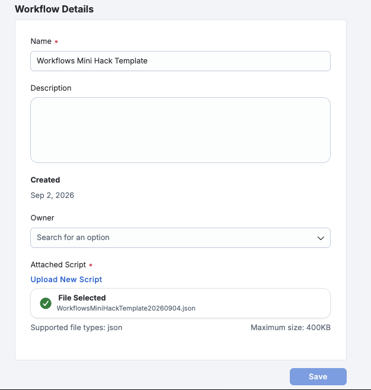
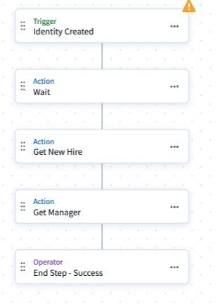
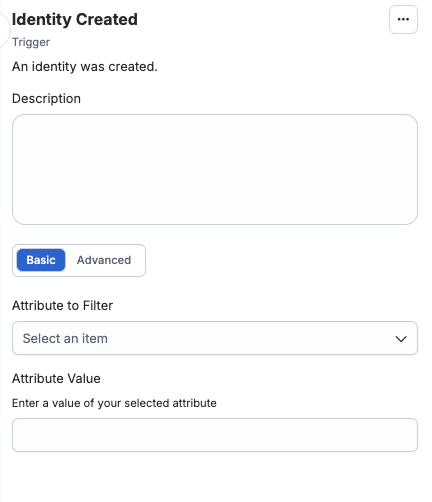
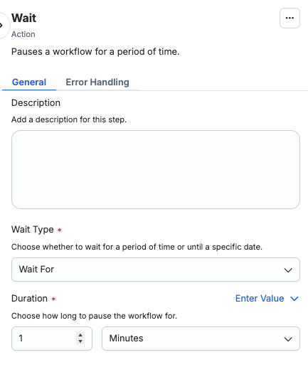
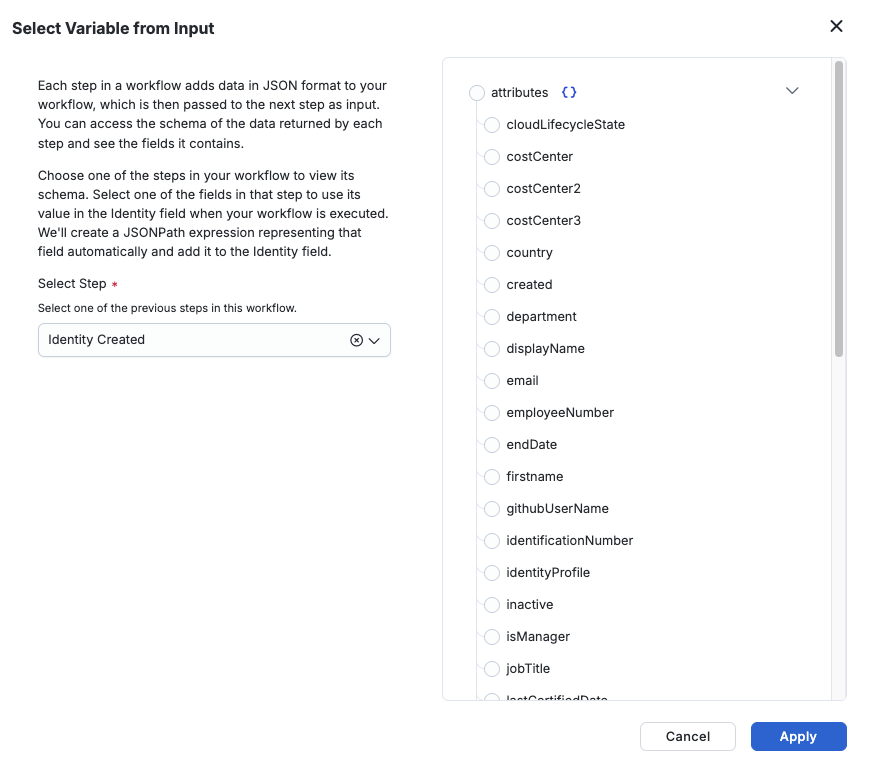
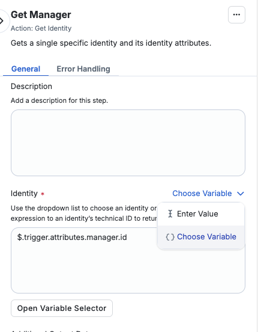
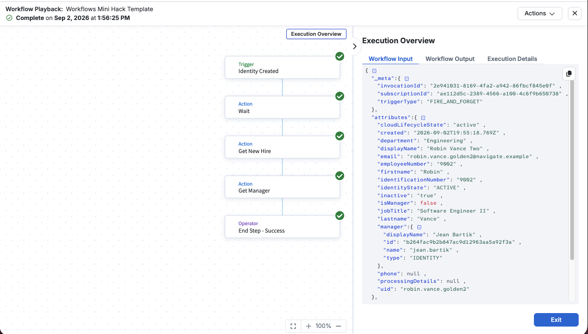

[← All Hack Day tracks](/hack-day)

# Track 01 · Workflows

Turn a real identity event into a real message. You will finish a partly-built Workflow Studio
workflow that wakes up the moment a new identity appears in SHF, looks up who
that person reports to, and emails a formatted onboarding notice — with the new hire's actual
department, title, and manager in it. No CLI, no local install, and nothing to deploy.

Nothing here is simulated. The trigger is a genuine SHF event, the identity is one you create
yourself by loading a row into an HR feed, and the email lands in your own inbox, which is what you
show a proctor at the end.

**You will need:** a browser, the mini hack tenant's admin credentials, and access to your email.

## What you are building

```
  You append a row          SHF creates the         Your workflow fires
  to the HR feed CSV  --->  identity during   --->  on idn:identity-created
  and aggregate             identity refresh
                                                               |
                                                               v
                                                     +------------------+
                                                     | Wait             |  <- pre-built
                                                     +---------+--------+
                                                               |
                                                               v
                                                     +------------------+
                                                     | Get New Hire     |  <- pre-built
                                                     +---------+--------+
                                                               |
                                                               v
                                                     +------------------+
                                                     | Get Manager      |  <- pre-built
                                                     +---------+--------+
                                                               |
                                                               v
                                                     +------------------+
                                                     | Send Email       |  <- YOU BUILD
                                                     | -> your inbox    |     THIS ONE
                                                     +---------+--------+
                                                               |
                                                               v
                                                       an email you can
                                                       show a proctor
```

You are building one step. That sounds small, and it is the step where two systems that know nothing
about each other have to be made to agree — which is most of what integration work actually is.


## Already built in your tenant

| Thing | Name | Where to find it | What it is for |
| --- | --- | --- | --- |
| Authoritative source | `Workflows Mini Hack HR Feed` | **Admin → Connections → Sources**, then open it by name | A delimited-file source. Loading a CSV row into it is how you manufacture a new identity on demand. |
| Identity profile | `Workflows Mini Hack HR Feed` | **Admin → Identities → Identity Profiles** | Turns each row of that CSV into an SHF identity, and resolves the `managerUid` column to a real manager identity. |
| Baseline identities | 8 of them | **Admin → Identities**, then search a name — try `Margaret Hamilton` | Ada Byron, Grace Hopper, Jean Bartik and friends. These exist so your new hire has somebody to report to. |
| Workflow | `Workflows Mini Hack Template` | **Admin → Workflows**, then open it and click **Edit** | Trigger configured, three steps built, **disabled**. This is what you edit. |
| Destination | Your own inbox | Your mail client — nothing to visit in SHF | Nothing to configure. SHF sends the mail; you supply the address. |

There is no destination to set up and no token to paste. You are the recipient, so the only thing
this exercise needs that is not already in your tenant is **your own email address**.

Two of those are worth opening before you start, because they are the two the workflow depends on and
neither is obvious from the canvas:

- **Open `Margaret Hamilton`** under Admin → Identities. Her **Manager** field shows *Jean Bartik* as
  a link, not as the text `jean.bartik`. That link is what makes the manager lookup in your workflow
  possible — it exists because the identity profile resolved a `uid` from the CSV into a pointer at a
  real person.
- **Open the source's `Accounts`** list, under Account Management. Same eight people, but here
  `managerUid` is just a string reading `jean.bartik`. Accounts hold text; identities hold references.
  That difference comes up again in step 1.

## A tour of what you are opening

**A workflow, in this platform, is two things:** a *trigger* that decides when it runs, and an
ordered chain of *steps* that run when it does. There is no code. Each step is a pre-built action you
configure by filling in fields, and each one can read the output of any step before it. That is the
whole model, and the workflow you are about to open is one trigger and four steps.

#### Finding the workflow

**Admin → Workflows.**



One workflow, `Workflows Mini Hack Template`, status **Disabled**.

**Disabled** means the workflow is not subscribed to anything — real events pass it by and it never
runs on its own. That is correct and deliberate: it is how you get to build and test in private,
without half-finished emails going out on every aggregation. It stays disabled until step 4.

#### The canvas

Open the workflow, then **Edit**.



Five nodes, top to bottom: the **trigger**, **Wait**, **Get New Hire**, **Get Manager**, and an
**End** step. Execution runs straight down — no branching here, though branching is possible.

Two things about the shape of it. Every step **points at the next one**, and the last step points at
an **End**, which is what tells the platform the run finished successfully. That matters the moment
you add a step of your own, because the end has to move down to sit after it.

And your work goes **between `Get Manager` and the End**. Everything above that is a worked example
of one pattern, which is what step 1 is about reading.

#### The trigger



**A trigger is the answer to "when should this run?"** Every workflow has exactly one, it sits at the
top of the canvas, and without it a workflow is just a list of steps nothing ever executes. There are
three kinds: **scheduled** (every night at 2am), **external** (something POSTs to a URL to start it),
and **event** — the platform itself tells you something happened.

This one is an **event trigger** on **Identity Created**, which is the event the platform publishes
the instant identity refresh materializes a new identity. That choice is what makes this a *joiner*
workflow rather than a report: nobody schedules it, nobody calls it, and it cannot run unless a real
person genuinely arrived.

The **filter** field is empty. A filter is an expression the platform evaluates on the event *before*
your workflow is invoked — events that fail it never reach you at all. Empty means every identity
creation in this tenant reaches your workflow, and SHF may warn you about exactly that. It is fine
here, because the only identities ever created in your tenant come from the HR feed. Filtering is a
stretch goal.

#### The Wait step



**A Wait step pauses the run.** That is all it does — the run holds at this point for the duration
you set, then continues.

It exists because the event arrives *faster than the data behind it*. Identity Created fires the
moment the identity is created, which is before the identity profile has finished populating its
attributes and resolving its manager. Look the person up immediately and you get a half-built record.
The wait is a minute; step 1 shows you exactly what the record looks like without it.

#### `Get New Hire`


**`Get New Hire` is not a special kind of step — it is a `Get Identity` action that somebody renamed.**
Worth understanding, because it explains a lot of what you will see later:

- **`Get Identity` is a built-in action.** Give it one identity id and it calls the platform's identity
  API for you and hands back that identity's full record — every attribute the platform holds, not
  just the few the event carried. No credentials, no endpoint, no code.
- **The name is yours to choose.** `Get New Hire` describes the *role* this lookup plays in this
  workflow. Two steps in this workflow are the same action doing different jobs, and naming them for
  their job is the only thing that keeps them apart on the canvas.
- **Its input is a variable, not a fixed value.** The identity-id field reads
  `$.trigger.identity.id` — "the id of the identity this event was about." Every run resolves it to a
  different person.

**How it applies here:** five of the six things your email needs — display name, department, job
title, and the two manager fields — are not in the event at all. This step is how they get into the
workflow. The event says *who*; this says *everything about them*.

#### The variable picker



**This is how data moves between steps.** Any field that accepts a variable has this control, and it
lists everything available at that point in the flow — the trigger's payload, plus the output of
every step above the one you are editing. Pick a value and it writes the path for you.

Two consequences worth noticing now. A step can only see steps *above* it, which is why order
matters. And the path it writes refers to a step by an internal name that is not always its display
name — you will meet that in step 3.

#### `Get Manager`




**The same `Get Identity` action a second time**, renamed for its job, with one difference that is
the whole point of the exercise: its input comes from **`Get New Hire`'s output** rather than from the
trigger. Specifically `managerRef.id` — the manager's identity id, taken off the record the previous
step fetched.

**Why a second lookup at all?** Because the new hire's record does not contain their manager. It
contains a *reference* to their manager — an id and a name — in the same way a row in a database
holds a foreign key rather than the whole related row. To put the manager's real name and email
address in your email, somebody has to go and fetch that second person. That is this step.

**How it applies here:** two of your six required values come from here and can come from nowhere
else. Step 1 explains why it reads `managerRef.id` and not the similar-looking field beside it.

#### Execution history

**Every time a workflow runs, it leaves a record here** — what triggered it, when, whether it
succeeded, and what every step did. This is where you go when something did not work.

There are already runs in here, and they are not yours. Setup loaded the eight baseline people, which
fired eight real events — five succeeded, three failed. You will borrow a payload from one of the
green ones in step 2, and you will understand the three red ones by the end of step 1.

#### Inside a single run



Click a run, then any step inside it, to see exactly what that step received and what it returned.
This panel is the most useful debugging tool in Workflow Studio and you will spend most of step 3 in
it — it shows you what your workflow *actually sent*, which is reliably more informative than what
you thought you wrote.

## How to get started

Work through the steps in order. You build one step, and each stage is testable on its own before you
move to the next. If a step leaves you stuck, open the hint under it to unblock yourself and keep
moving.

### 1. Read what is already there

Go to **Admin → Workflows**. You will see `Workflows Mini Hack Template` with a status of
**Disabled**. Open it, then click **Edit** to open it in the builder.

**Why it is disabled.** A disabled workflow is not subscribed to its trigger. Real
`idn:identity-created` events will fire in this tenant while you work, and they will pass this
workflow by without running it.

That is deliberate, and it is what makes the next two steps comfortable: **Test Workflow runs on
demand regardless of the status**, so you can execute this thing as often as you like while it is
disabled, reading real output the whole time, and nothing you half-finish ever reaches an inbox. You
flip it to Enabled in step 4, once it works — and only then does a real joiner set it off.

It is also how you should work in a real tenant. Building enabled means every aggregation becomes a
live test of an unfinished workflow.

#### What the event actually hands you

Click the trigger, then look at what the event gives you. This is a real payload, captured from a real
identity creation in a tenant just like yours:

```json
{
  "identity": {
    "id": "9e1e75cf85d8421885b79befb4438608",
    "name": "robin.vance.golden",
    "type": "IDENTITY"
  },
  "attributes": {
    "created": "2026-09-02T18:45:40.100Z",
    "displayName": "robin.vance.golden",
    "email": null,
    "employeeNumber": null,
    "firstname": null,
    "lastname": null,
    "manager": null,
    "isManager": false,
    "inactive": "true",
    "phone": null
  }
}
```

Read that again, because almost everything in it is useless:

- `email`, `firstname`, `lastname`, `employeeNumber`, `manager` — **all null**
- `displayName` is the raw `uid`, not `Robin Vance`
- `inactive` is `"true"`
- There is **no `department`, no `jobTitle`, no `uid`** — those fields do not exist in this payload at
  all, at any value

The event fires the *instant* the identity is materialized, before the identity profile's mappings
and the manager resolution have populated it. So the honest summary of an `idn:identity-created`
payload is: **it tells you who joined, and nothing else.**

Five of the six things your message needs are not in there. That is not a limitation to work around —
it is the thing to understand, and the next three steps are the answer to it.

#### Why the nulls, and why the Wait

Those nulls are a timing artifact, not a bug. The event fires the instant the identity is
materialized — *before* the identity profile has finished populating its attributes and resolving its
manager. The record settles a moment after the notification about it.

That is what the Wait step is for, and it is the reason it cannot be removed. It is also what
eventual consistency looks like in a real event-driven system: the notification is fast, the data
behind it lands slightly later, and anything that assumes otherwise works when you test it by hand
and fails in production.

#### The gap that is the whole lesson

Open one of the green setup runs in your execution history, click **`Get New Hire`**, and read its
output panel next to the payload above.

Same person. One has `department`, `jobTitle`, a real `displayName`, and a manager reference. The
other has almost nothing. **That gap is the lesson.** The event is a notification, not a data feed —
it tells you something happened and hands you an id. When you need the data, you go and fetch it.

#### The two manager fields

Now click **`Get Manager`** and look at where its id comes from. Then look back at `Get New Hire`'s
output, where you will find two manager-ish fields:

| Field | Holds | Useful for a lookup? |
| --- | --- | --- |
| `attributes.manager` | The string `jean.bartik` — a `uid` | **No.** It is a name, not an id. |
| `managerRef` | `{ "id": "...", "name": "jean.bartik" }` | **Yes.** `managerRef.id` is an identity id. |

`Get Identity` needs an id, so only `managerRef.id` works. That distinction — a reference to a person
versus a string that names them — is the same one that runs through this whole exercise.

:::info

Your execution history already has runs in it, and they are not yours. Setup loaded the eight
baseline people, which fired eight real events. Five went green; three failed, because Ada Byron,
Katherine Johnson, and Mary Jackson sit at the top of the org chart and have no manager to fetch.

Those runs are useful — you will borrow a payload from one in step 2 — but finishing this exercise
means producing a *new* run, for a person *you* create.

:::

<details>
<summary>See details: why not read the manager from the trigger payload?</summary>

Because it is not there. `"manager": null`, every time.

Even setting the timing aside, the payload's attribute list is fixed and short, and a manager
reference on a freshly created identity has not been resolved yet — the correlation that turns
`managerUid: jean.bartik` into a pointer at Jean's identity runs as part of identity refresh, which
is the process still finishing while your event is in flight.

So the manager has to come from a record you fetch, after a wait. There is no shortcut, and the two
lookups are not redundant: the first tells you who the manager *is*, the second tells you anything
*about* them.

- [Event triggers](/docs/extensibility/event-triggers/)
- [`idn:identity-created` payload reference](/docs/extensibility/event-triggers/available-event-triggers/identity-created)

</details>

<details>
<summary>See details: the three failed runs, and why they matter</summary>

Ada Byron, Katherine Johnson, and Mary Jackson have an empty `managerUid` in the HR feed. Their
identities therefore have no `managerRef`, `Get Manager` is asked to fetch an identity with no id,
and the run fails.

That is not a defect in the exercise. Executives, founders, and contractors arrive without managers
constantly, and a joiner workflow that dies on them is a joiner workflow that pages somebody at 2am.
Handling it properly is the first stretch goal, and those three red runs are sitting in your history
as a free demonstration of the problem.

</details>

### 2. Test it and read the output

In the builder, use **Test Workflow**. It asks for a trigger payload — you handing the workflow the
same envelope the event bus would, without waiting for a real event.

:::warning

**Do not use the default sample payload it offers you.** That payload is SailPoint's documentation
example — John Doe, `william.wilson`, `department: "Sales"`, `uid: "E009"` — and it will fail
immediately with `404 Not Found`, because those identity ids do not exist in your tenant. It is also
**fully populated**, which makes it actively misleading about what a real event carries.

:::

Get a real payload instead, from a real run:

1. Leave the builder and open the workflow's **execution history**.
2. Open one of the **green** setup runs.
3. Copy its trigger input.
4. Paste that into Test Workflow.

Only `identity.id` has to be real — that is the only field the workflow reads from the trigger — but
copying a whole real payload is easier than editing one, and it keeps you looking at the truth.

Run it. You are looking for **three green steps**, and two output panels worth reading:

- **`Get New Hire`** — a full identity record. Note the exact paths to `department`, `jobTitle`, and
  `displayName`. You will need all three in the next step.
- **`Get Manager`** — a different human's record. Note the paths to their `displayName` and their
  email. If both panels show the *same* person, something is wired to the wrong id.

:::tip

Use the variable picker, do not memorize paths. Anywhere a Workflow Studio field takes a variable
there is an insert-variable control listing every value available at that point in the flow,
including every preserved field of every earlier step. It writes the correct path for you. Guessing
paths is the fastest way to get stuck here.

:::

Two things about testing. Every test pauses on the Wait step, which is real and runs during tests
too, so a test is never instant. And **Test Workflow runs regardless of whether the workflow is
enabled** — so the entire build-and-iterate loop happens while the workflow is disabled and silent.
You enable it once, at the end, when it works.

<details>
<summary>See details: what to check if the test fails</summary>

- **`404 Not Found` on `Get New Hire`** — you used the default sample payload, or a payload from
  somebody else's tenant. Identity ids are tenant-local. Get one from your own execution history.
- **`expected top-level JSON object in string, got array without attribute wrapper`** — a
  `Get Identity` step received an *empty* id. It does not error on that; it lists every identity in
  the tenant and then chokes on the array. Nothing in the message mentions the null id. Find the
  lookup whose id expression resolved to nothing.
- **`Get Manager` fails, or returns nobody** — the identity in your payload has no manager. Use a
  payload from one of the *green* setup runs, not one of the three red ones.
- **Test Workflow grayed out** — unsaved changes. Save, then test.

</details>

### 3. Add the step that sends the message

Add a **Send Email** action **after `Get Manager`**. It takes three things: who it goes to, a
subject, and a body. No connector, no credentials, no endpoint — SHF sends the mail itself.

:::caution

**Then add an End step after it.** Every step must point at something, and your new step is now the
last one in the chain. Without an end, the workflow will not save or test, and the error you get is
`Err: next is not defined` naming your email step — which reads like your step is broken when
actually nothing follows it. Re-checking the recipient and body will not help; add the end.

:::

Configure it:

| Field | Value |
| --- | --- |
| To | **TODO** — your own email address |
| Subject | **TODO** — must contain the new hire's display name |
| Body | **TODO** — see below |

**Six things have to be in the message,** and a proctor will check every one:

| # | Thing | Comes from |
| --- | --- | --- |
| 1 | The new hire's **display name**, in the **subject line** | `Get New Hire` |
| 2 | The new hire's **display name**, in the body | `Get New Hire` |
| 3 | Their **department** | `Get New Hire` |
| 4 | Their **job title** | `Get New Hire` |
| 5 | Their manager's **display name** | `Get Manager` |
| 6 | Their manager's **email address** | `Get Manager` |

The subject matters because it is the first thing a proctor sees, and a subject that reads
`New joiner: Robin Vance` proves the workflow reached into a fetched record before it composed
anything.

A body shape to start from — the wording is yours, the six values are not:

```
A new identity has been created in SHF.

  Name:        TODO
  Department:  TODO
  Job title:   TODO

  Reports to:  TODO (TODO)
```

**Seven TODOs in this step**: the recipient, the subject, and the five values in the body. One is
your own email address, typed literally. The other six are variables, and every one of them comes out
of a lookup rather than out of the trigger — which is the whole point of the three steps above yours.

Save. Test. Then check your inbox — a test run sends a *real* email, because there is nothing fake
about this step. That is your iteration loop: edit, save, test, refresh your mail, repeat.

**Why this step is the interesting one.** Everything before it had exactly one right answer. Here you
are deciding what a human should be told and where each piece of it comes from, and the mistakes all
live in the seams: a variable path off by one level, an object printed where a string was wanted, a
field that happens to be null for this particular person. That is the actual work of integration, and
it is the same work whether the far side is a mailbox, Slack, or ServiceNow.

<details>
<summary>See details: the five failures worth recognizing on sight</summary>

**The email arrives with `$.getIdentity.attributes.department` printed literally.** Your variable went
in as plain text instead of as a variable reference. Delete it and re-insert with the picker.

**A value arrives as `[object Object]`, or as `{"id":"...","name":"jean.bartik"}`.** You pointed at a
reference object instead of a scalar inside it. Go one level deeper.

**A value is blank.** That field is genuinely empty on the record, or the path is subtly wrong. Open
the run history, click the step, and read what it actually sent — that tells you which of the two it
is immediately.

**The manager's name is `jean.bartik` rather than `Jean Bartik`.** You used `attributes.manager` or a
`uid` field. The manager's real name is on `Get Manager`'s output, not on the new hire's record.

**The step is green but no email arrives.** Green means SHF accepted and sent it. Check your spam or
junk folder first — mail from a sandbox tenant is exactly the kind of thing a filter dislikes. Then
check the recipient address for a typo, by reading it out of the run history rather than out of the
step config, so you see what was actually sent.

</details>

<details>
<summary>See details: the whole step, click by click</summary>

If you have been at this a while, here is the entire answer. Working through it and understanding it
afterwards beats staring at a red step.

**1. Add the step.** On the canvas, use the `+` control **directly below `Get Manager`** and choose
**Send Email**. Adding it inline this way connects it on both sides; dropping it onto empty canvas
leaves it dangling.

**2. Add an End step below it.** Your email step is now the last real step, and it needs somewhere to
point. Skip this and you get `Err: next is not defined` naming your email step.

**3. TODO 1 — the recipient.** Your own email address, typed literally. This is the only value in the
step that is not a variable.

**4. TODO 2 — the subject.** Literal text plus one variable:

```
New joiner: $.getIdentity.attributes.displayName
```

**5. TODOs 3 to 7 — the body.** Completed, it looks like this. Every value is an inserted variable:

```
A new identity has been created in SHF.

  Name:        $.getIdentity.attributes.displayName
  Department:  $.getIdentity.attributes.department
  Job title:   $.getIdentity.attributes.jobTitle

  Reports to:  $.getIdentity1.displayName ($.getIdentity1.emailAddress)
```

**6. Where each value comes from**, if those paths do not match what your picker offers:

| Value | Step | Field to insert |
| --- | --- | --- |
| New hire's name | `Get New Hire` | `attributes.displayName` |
| Department | `Get New Hire` | `attributes.department` |
| Job title | `Get New Hire` | `attributes.jobTitle` |
| Manager's name | `Get Manager` | `displayName` |
| Manager's email | `Get Manager` | `emailAddress` |

**Insert every one with the picker.** Note that `getIdentity` is `Get New Hire` and `getIdentity1` is
`Get Manager` — steps carry internal names that differ from their display names, which is why the
paths above look nothing like the labels on your canvas. If your steps were built in a different
order those internal names differ, so treat the paths above as a sanity check rather than something
to type: **whatever the picker generates is correct.**

**7. Save**, then **Test Workflow** with a payload from a green run in your execution history.

**8. Check your inbox.** One email, six values in it, nothing reading `[object Object]`. If the run
went green and nothing arrived, check spam before anything else.

- [Workflow actions](/docs/extensibility/workflows/actions/)
- [Workflow operators and variables](/docs/extensibility/workflows/operators)

</details>

### 4. Enable the workflow

Save, leave the builder, and flip the workflow from **Disabled** to **Enabled**.

Everything so far ran because you asked it to. A disabled workflow is invisible to the event bus —
`idn:identity-created` events have been firing in this tenant the whole time and yours ignored every
one. Enabling it is what subscribes it.

This ordering is deliberate, and it is how you should work in a real tenant too. Build and iterate
disabled, where the only executions are ones you triggered. Enable when it works. Turning it on first
and debugging afterwards means every aggregation becomes a live test of a half-finished workflow.

:::caution

SHF tracks consecutive failures per workflow and will **disable a workflow that keeps failing**, so
one broken flow cannot generate errors forever. Enabled-and-broken is a state with consequences, and
it gets turned off at a moment of its own choosing rather than yours.

:::

### 5. Fire the real event

Time to add a person to this company!

1. **Download [`hr-feed.csv`](./hr-feed.csv).** Eight baseline rows, twelve columns wide — the
   same file that was loaded into your tenant during setup, so it already matches what is in there.
2. **Append exactly one row**, copying and pasting from an existing employee. Change at least:
   - `uid` — make it unmistakably yours and **unique**, e.g. `robin.vance.sam`. Reusing an existing
     `uid` is the most common reason nothing happens.
   - `email` — match the uid
   - `fullname` — this becomes the identity's display name, so make it a real-looking name
   - `department` and `jobTitle` — these end up in your email, so make them yours
   - `managerUid` — **must exactly match the `uid` of one of the baseline rows.** `jean.bartik` is a
     safe choice. Pick one of the three people with a blank `managerUid` and `Get Manager` will fail.
3. **Upload the whole file** to **Admin → Connections → Sources → `Workflows Mini Hack HR Feed` →
   Account Aggregation**.

:::caution

**Upload all nine rows, not just yours.** A delimited-file aggregation is not an append — SHF treats
the file as the complete current state of the source, so anyone present last time and missing now is
a deletion. Upload a one-row file and you are telling SHF that eight people left the company. A
deletion threshold will catch that and **cancel the whole aggregation**, so nothing breaks — but
nothing happens either, and you will sit waiting for an event that is never coming.

:::

Then wait, and know what you are waiting for. There are three stages, not one:

| Stage | What happens |
| --- | --- |
| Aggregation | Your **account** arrives on the source |
| Identity refresh | The account becomes an **identity** — this is the moment your event fires |
| Your workflow | Waits a minute, then runs two lookups and sends your email |

Two places to watch: **Admin → Identities** for your new hire, and your workflow's **execution
history** for a new run. Then check your inbox.

<details>
<summary>See details: nothing happened</summary>

Work down this list in order — roughly most to least likely.

1. **Is the workflow enabled?** Step 4. Easy to skip.
2. **Did the aggregation actually succeed?** Check Aggregation History. If it was **canceled**, you
   uploaded a partial file — see the warning above. Re-upload all nine rows.
3. **Does the identity exist?** Search Admin → Identities. If the account aggregated but no identity
   appeared, your row did not satisfy the identity profile — usually a missing `uid` or `email`.
4. **Did you reuse a `uid`?** A `uid` that already exists correlates to the existing identity and
   *updates* it. Updates are not creations, and `idn:identity-created` does not fire for them. Change
   the `uid` and upload again.
5. **Is there a run in the execution history?** If yes, the event fired and your workflow is what
   broke — open it and the failing step will tell you which. If no, the event never reached you; go
   back to 1–4.
6. **Have you waited long enough?** Aggregation, then refresh, then a one-minute wait inside the
   workflow. Give it a few minutes before concluding anything.

</details>

### 6. Check your work

Show a proctor the email in your inbox. It should have:

- [ ] The new hire's display name **in the subject line**
- [ ] The new hire's display name in the body, matching the row you loaded
- [ ] The correct department
- [ ] The correct job title
- [ ] The manager's **display name** — not their `uid`, not `[object Object]`
- [ ] The manager's **email address**

And in your tenant:

- [ ] The workflow is **Enabled**
- [ ] Its execution history has a successful run **for the new hire you created**, triggered by a real
      `idn:identity-created` event rather than by Test Workflow

**Show the proctor both.** The email proves you composed the right message; the run history proves the
platform noticed a person joined and acted on it without anybody asking. A green test run only proves
the first. That second box is what separates this from a mail-merge.

### 7. Stretch goals

Pick whichever looks most interesting. Each one maps to something a production joiner workflow
actually has to deal with.

- **Survive a missing manager.** Add a condition before `Get Manager` that checks whether
  `managerRef.id` is populated, and route the no-manager case to a different message — "no manager on
  record, routing to HR" — instead of failing. Test it by loading a row with an empty `managerUid`.
  Then look at the three red runs sitting in your history from setup: Ada, Katherine, and Mary. You
  will have just fixed a bug that was there before you arrived.
- **Filter at the trigger.** A filter is a JSONPath expression SHF evaluates on the event *before*
  invoking your workflow. Events that fail it never reach you: no execution consumed, nothing in your
  history, nothing to fail. Add one so only one department's joiners reach the workflow, then load two
  rows in two departments and confirm only one email arrives — and only one run appears. Compare that
  with doing the same check as a condition step inside the workflow: same outcome, but the filtered
  version never ran at all.
- **Route on department.** Branch so Engineering joiners produce a different message, or go to a
  different recipient, than Finance joiners. This is where most real joiner workflows spend their
  complexity.
- **Send it to the manager instead of yourself.** You already have the manager's email address in
  `Get Manager`'s output — so use it as the *recipient* and rewrite the message as something Jean
  Bartik would actually want to read on her new report's first day. Every address involved is
  fictional, so nothing leaves the tenant.
- **Grant access, not just talk about it.** Add a **Manage Access** action that assigns an access
  profile to the new hire, and name what it granted in your email. This is the line between
  notification and provisioning, and it is worth crossing once to see how short the step is.
- **Put a human in the loop.** Use a **Create Form** action to ask the manager to confirm the new
  hire's access before anything is granted, and have the workflow wait on the answer. The automation
  gathers context and drafts the decision; a person makes it.
- **Tune the wait.** The Wait step is set to one minute because that is comfortably enough. Find out
  what is actually enough — drop it to fifteen seconds and see whether `managerRef` is populated in
  time. You are measuring how long identity refresh takes to settle, which is a genuinely useful
  number to know about a tenant.
- **Swap the mail for an HTTP call.** Replace Send Email with an **HTTP Request** step pointed at any
  endpoint that will accept JSON. This is the general-purpose escape hatch in Workflow Studio: any
  system reachable over HTTP is reachable from a workflow, with no connector and no code. It is also
  where the real integration pain lives — auth headers, body shapes, and error codes that tell you
  nothing.
- **Make it fail on purpose.** Break the step deliberately — a malformed recipient, or an HTTP Request
  at a URL that returns 500 — and read what the run history shows you. Then find where
  consecutive-failure handling lives and read what SHF will do to your workflow if you leave it that
  way.

## Documentation

- [Workflows overview](/docs/extensibility/workflows/)
- [Building workflows](/docs/extensibility/workflows/building-workflows) — the builder, step by step
- [Workflow triggers](/docs/extensibility/workflows/triggers) — what starts a workflow, and how
- [Event triggers](/docs/extensibility/event-triggers/) — every trigger type and its payload
- [`idn:identity-created` payload reference](/docs/extensibility/event-triggers/available-event-triggers/identity-created)
- [Workflow actions](/docs/extensibility/workflows/actions/) — what Get Identity, Send Email, Manage
  Access, and Create Form each take and return
- [Workflow operators and variables](/docs/extensibility/workflows/operators) — the expression syntax
  behind the variable picker
- [Workflow examples library](/docs/extensibility/workflows/examples/)
- [Workflows API](/docs/api/beta/workflows) — read, create, and version workflows as JSON

## Still stuck?

Grab a SailPoint developer advocate in the room, or reach for the community and tooling.

- [Developer Forum](https://developer.sailpoint.com/discuss/)
- [SDKs](/docs/tools/sdk)
- [CLI](/docs/tools/cli)
- [Back to all tracks](/hack-day)
